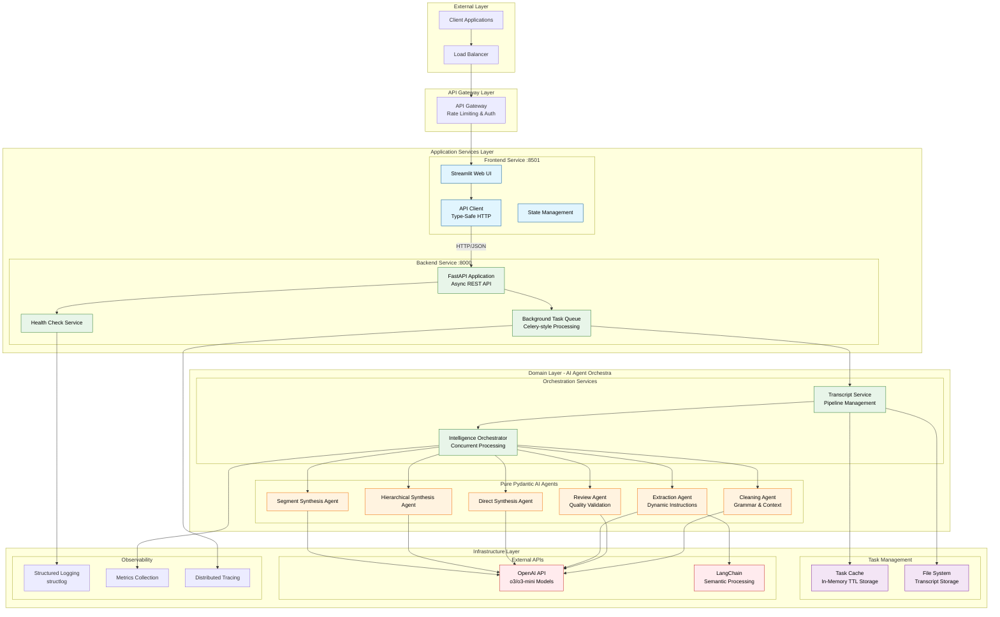

# Meeting Intelligence System

## About The Project

### The Challenge

Modern organizations generate thousands of hours of meeting recordings, but extracting actionable intelligence from transcripts remains a manual, time-intensive process. Existing solutions either lack technical depth, hallucinate information, or fail to preserve critical business context.

### Our Solution

The **Meeting Intelligence System** is a production-ready, microservices-based platform that transforms raw VTT transcripts into executive-quality summaries while preserving technical accuracy and business context. Built with modern cloud-native patterns and advanced AI agents.

---

## System Architecture

### Architectural Principles

Our system follows **simplified microservices** and **clean architecture** principles optimized for containerized deployments:

- **Stateless Services**: Horizontally scalable services with no persistent state
- **Event-Driven Architecture**: Asynchronous processing with background task queues
- **In-Memory Caching**: Simple TTL-based task storage for ephemeral container environments
- **Dependency Injection**: Loose coupling through interface-based design
- **Pure Function Agents**: Stateless AI agents for concurrent safety and reliability

### High-Level Architecture



### Service Boundaries & Responsibilities

#### Frontend Service (`frontend/`)

**Responsibility**: User interface and user experience management

- **Streamlit Web Application**: Interactive UI with real-time progress tracking
- **API Client**: Type-safe HTTP client with automatic retry and error handling
- **State Management**: Session state persistence and form validation
- **Responsive Design**: Mobile-friendly interface with modern UX patterns

#### Backend Service (`backend/`)

**Responsibility**: Business logic orchestration and API management

- **FastAPI Application**: High-performance async REST API with OpenAPI documentation
- **Background Task Processing**: Queue-based long-running operations with progress tracking
- **Health Check System**: Kubernetes-ready liveness and readiness probes
- **Request/Response Pipeline**: Validation, serialization, and error handling

#### Agent Domain (`backend/agents/`)

**Responsibility**: AI-powered content processing and intelligence extraction

- **Pure Pydantic AI Agents**: Stateless, concurrent-safe agents with built-in validation
- **Dynamic Instruction System**: Context-aware prompt adaptation based on processing requirements
- **Quality Assurance Pipeline**: Multi-stage validation with automatic retry mechanisms
- **Concurrent Processing**: Parallel execution with proper error isolation

### Data Flow Architecture


---

## Getting Started

### Docker Deployment

```bash
# Build containers
just docker-build

# Start all services
just docker-run

# View logs
just docker-logs

# Stop services
just docker-stop
```

### Access Points

Once deployed, access the system at:

- 🖥️ **Frontend Application**: http://localhost:8501
- 🔧 **Backend API**: http://localhost:8000
- 📚 **API Documentation**: http://localhost:8000/docs
- ❤️ **Health Check**: http://localhost:8000/health

<p align="right">(<a href="#top">back to top</a>)</p>

---

## Usage

### Quick Start Example

1. **Upload VTT Transcript**
    - Navigate to http://localhost:8501
    - Upload your meeting transcript (.vtt file)
    - Wait for cleaning and review completion

2. **Extract Intelligence**
    - Go to Intelligence tab
    - Select detail level (Standard/Comprehensive/Technical Focus)
    - Click "Extract Intelligence"
    - Review generated summary and action items

### API Reference

#### Core Endpoints

**Upload & Process Transcript**

```http
POST /api/v1/transcript/process
Content-Type: multipart/form-data

Form Data:
- file: transcript.vtt
- detail_level: "comprehensive" (optional)
```

**Extract Meeting Intelligence**

```http
POST /api/v1/intelligence/extract
Content-Type: application/json

{
  "transcript_id": "uuid-task-id",
  "detail_level": "comprehensive"
}
```

**Task Management**

```http
GET /api/v1/task/{task_id}
DELETE /api/v1/task/{task_id}
```

**System Health**

```http
GET /health        # Basic health check
GET /health/ready  # Readiness probe
GET /docs         # OpenAPI documentation
```

#### Response Examples

**Intelligence Extraction Response:**

```json
{
    "transcript_id": "abc-123",
    "intelligence": {
        "summary": "# Executive Summary\n\nComprehensive meeting analysis...",
        "action_items": [
            {
                "description": "Complete database migration testing",
                "owner": "Engineering Team",
                "due_date": "Next Tuesday"
            }
        ],
        "processing_stats": {
            "chunks_processed": 12,
            "insights_extracted": 48,
            "processing_time_seconds": 6.2
        }
    }
}
```
