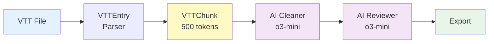
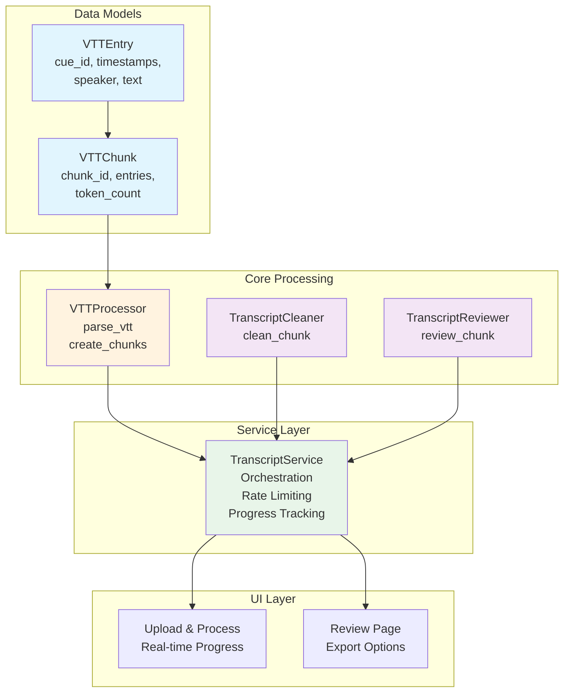
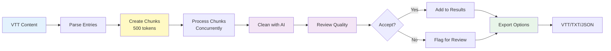

# VTT Transcript Cleaner

## AI-Powered VTT Processing with Simplified 2-Layer Architecture

A streamlined transcript cleaning system that processes VTT (WebVTT) files through a simplified 2-layer architecture with dual AI agents. Built for performance and simplicity, achieving <2 second per chunk processing with enterprise-grade error handling.

## Table of Contents

- [Quick Start](#quick-start)
- [Architecture Overview](#architecture-overview)
- [Key Features](#key-features)
- [System Design](#system-design)
- [Technology Stack](#technology-stack)
- [Installation](#installation)
- [Usage](#usage)
- [Configuration](#configuration)
- [Performance](#performance)
- [API Models](#api-models)
- [Testing](#testing)
- [License](#license)

## Quick Start

```bash
# Clone and install
git clone https://github.com/username/minutes-cleaner.git
cd minutes-cleaner
uv sync

# Configure API key
cp .env.example .env
# Add your OpenAI API key to .env

# Run application
streamlit run streamlit_app.py
```

## Architecture Overview

### Simplified 2-Layer Processing



### Key Improvements from Previous Architecture

- **Removed Complexity**: Eliminated ConversationTurns, ProcessingSegments, EnrichedContext layers
- **Direct Processing**: VTT entries parsed directly into token-based chunks
- **Simplified Context**: Only uses previous 200 characters for context (no complex enrichment)
- **Smaller Codebase**: <1000 lines total (down from 4000+)
- **Faster Processing**: <2 seconds per chunk with concurrent API calls

## Key Features

### 🚀 Performance Optimized

- **Concurrent Processing**: Async processing with rate limiting (20 req/min)
- **Smart Chunking**: 500-token chunks with simple character-based estimation
- **Minimal Context**: Only 200 chars from previous chunk for continuity
- **Enterprise Error Handling**: Exponential backoff retry with tenacity

### 🎯 VTT-Native Processing

- **Direct VTT Parsing**: Regex-based parser for VTT cue blocks
- **Speaker Preservation**: Maintains exact speaker labels throughout
- **Timestamp Accuracy**: Preserves original timestamps for export
- **Multi-line Support**: Handles multi-line text within `<v>` tags

### 🤖 Dual-Agent AI System

- **Cleaning Agent**: Fixes grammar, removes fillers, maintains conversation flow
- **Review Agent**: Validates quality, ensures speaker/meaning preservation
- **Structured Output**: JSON responses with confidence scoring
- **Model Flexibility**: Supports o3-mini (default) and GPT-4 models

## System Design

### Component Architecture



### Processing Pipeline



## Technology Stack

| Component           | Technology                 | Purpose                                  |
| ------------------- | -------------------------- | ---------------------------------------- |
| **Framework**       | Streamlit                  | Web UI and application framework         |
| **AI Client**       | OpenAI AsyncAPI            | Async AI model interactions              |
| **Models**          | o3-mini / GPT-4            | Text cleaning and review                 |
| **Logging**         | structlog                  | Structured, contextual logging           |
| **Async**           | asyncio + asyncio-throttle | Concurrent processing with rate limiting |
| **Retry Logic**     | tenacity                   | Exponential backoff for API calls        |
| **Package Manager** | uv                         | Fast Python package management           |
| **Environment**     | python-dotenv              | Configuration management                 |

## Installation

### Prerequisites

- Python 3.11+
- OpenAI API key (with o3-mini or GPT-4 access)
- 2GB RAM minimum

### Detailed Setup

1. **Clone repository**

```bash
git clone https://github.com/username/minutes-cleaner.git
cd minutes-cleaner
```

2. **Install dependencies with uv**

```bash
# Install uv if not already installed
pip install uv

# Sync dependencies
uv sync
```

3. **Configure environment**

```bash
# Create .env file
cat > .env << EOF
OPENAI_API_KEY=sk-your-api-key-here
CLEANING_MODEL=o3-mini  # or gpt-4
REVIEW_MODEL=o3-mini    # or gpt-4
EOF
```

4. **Run application**

```bash
streamlit run streamlit_app.py
```

## Usage

### Processing Workflow

1. **Upload VTT File**: Drag and drop your VTT transcript
2. **Automatic Processing**:
    - Parses VTT into entries
    - Creates 500-token chunks
    - Processes with AI agents
3. **Review Results**: See processing metrics and quality scores
4. **Export**: Choose format (VTT, TXT, JSON)

### Example Code Usage

```python
from services.transcript_service import TranscriptService

# Initialize service
service = TranscriptService(api_key="your-api-key")

# Process VTT content
with open("meeting.vtt", "r") as f:
    content = f.read()

# Parse and chunk
transcript = service.process_vtt(content)
print(f"Created {len(transcript['chunks'])} chunks")

# Clean with AI
import asyncio
cleaned = asyncio.run(service.clean_transcript(transcript))

# Export results
output = service.export(cleaned, format="txt")
```

## Configuration

### Environment Variables

```bash
# Required
OPENAI_API_KEY=sk-xxx        # Your OpenAI API key

# Optional (defaults shown)
CLEANING_MODEL=o3-mini        # Model for cleaning (o3-mini or gpt-4)
REVIEW_MODEL=o3-mini          # Model for review (o3-mini or gpt-4)
```

### Processing Settings (config.py)

```python
TARGET_CHUNK_TOKENS = 500    # Tokens per chunk
CONTEXT_CHARS = 200          # Context from previous chunk
ACCEPT_THRESHOLD = 0.7       # Auto-accept if quality >= 0.7
```

## Performance

### Benchmarks

| Metric             | Value          | Notes                          |
| ------------------ | -------------- | ------------------------------ |
| **Parsing Speed**  | <1 second      | 1300+ entries parsed instantly |
| **Chunking Speed** | <0.5 seconds   | Token estimation: len/4        |
| **API Processing** | 1-2 sec/chunk  | With o3-mini model             |
| **Total Time**     | ~60-80 seconds | For 40 chunks (20,000 words)   |
| **Concurrency**    | 3 parallel     | Rate limited to 20/min         |
| **Memory Usage**   | <200MB         | Efficient streaming            |

### Optimization Features

- **Async Processing**: Concurrent API calls with semaphore control
- **Rate Limiting**: Throttler prevents API rate limit errors
- **Retry Logic**: Exponential backoff (2, 4, 8 seconds)
- **Progress Tracking**: Real-time updates via callbacks
- **Error Resilience**: Individual chunk failures don't stop pipeline

## API Models

### Supported Models

| Model             | Use Case                 | Speed  | Quality    |
| ----------------- | ------------------------ | ------ | ---------- |
| **o3-mini**       | Default, fast processing | Fast   | Good       |
| **gpt-4**         | Higher quality output    | Slower | Excellent  |
| **gpt-3.5-turbo** | Budget option            | Fast   | Acceptable |

### Model-Specific Handling

The system automatically adjusts parameters based on model:

- o3 models: No temperature/max_tokens parameters
- GPT models: Temperature 0.2 for cleaning, 0.0 for review

## Testing

### Test Coverage

```bash
# Run all tests
uv run pytest tests/ -v

# Run specific test modules
uv run pytest tests/test_vtt_processor.py -v
uv run pytest tests/test_ai_agents.py -v
uv run pytest tests/test_transcript_service.py -v

# Run with coverage
uv run pytest tests/ --cov=. --cov-report=html
```

### Test Structure

```
tests/
├── conftest.py              # Shared fixtures
├── test_vtt_processor.py    # VTT parsing and chunking
├── test_ai_agents.py        # AI agent functionality
└── test_transcript_service.py # Service orchestration
```

## Project Structure

```
minutes-cleaner/
├── models/
│   └── vtt.py              # VTTEntry, VTTChunk dataclasses
├── core/
│   ├── vtt_processor.py    # VTT parsing and chunking
│   └── ai_agents.py        # TranscriptCleaner, TranscriptReviewer
├── services/
│   └── transcript_service.py # Orchestration and rate limiting
├── pages/
│   ├── 1_📤_Upload_Process.py # Upload and processing UI
│   └── 2_👀_Review.py         # Review and export UI
├── utils/
│   ├── ui_components.py    # Reusable UI components
│   └── diff_viewer.py      # Diff visualization
├── tests/                  # Test suite
├── config.py              # Configuration
├── streamlit_app.py       # Main application entry
└── pyproject.toml         # Dependencies
```

## License

MIT License - See LICENSE file for details
