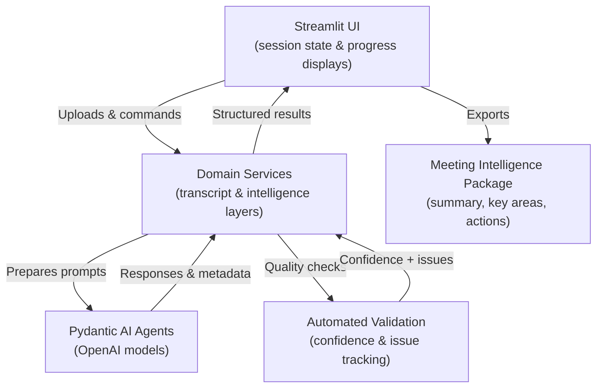
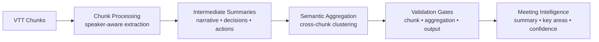

# Minutes Cleaner – Meeting Intelligence Prototype

Minutes Cleaner is a Streamlit-driven experience that transforms raw WebVTT meeting transcripts into cleaned text, quality assessments, and rich meeting intelligence. The application keeps everything in a single process: the UI orchestrates domain services directly, and the AI pipeline lives entirely in Python, making iteration fast while remaining production-conscious.

---

## Contents

- [Minutes Cleaner – Meeting Intelligence Prototype](#minutes-cleaner--meeting-intelligence-prototype)
  - [Contents](#contents)
  - [Feature Overview](#feature-overview)
  - [System Architecture](#system-architecture)
  - [Intelligence Pipeline](#intelligence-pipeline)
  - [Configuration](#configuration)
  - [Local Development](#local-development)
    - [Prerequisites](#prerequisites)
    - [Install Dependencies](#install-dependencies)
    - [Run Streamlit](#run-streamlit)
    - [Tests \& Linters](#tests--linters)
  - [Docker Support](#docker-support)
  - [Usage Walkthrough](#usage-walkthrough)
  - [Notes \& Limitations](#notes--limitations)

---

## Feature Overview

- **Three-step UX** – Upload transcripts, review the cleaned output, then generate intelligence.  
- **AI-assisted transcript grooming** – Automatic noise removal and quality scoring for long-form meetings.  
- **Meeting intelligence** – Authority-aware extraction of key themes, decisions, and action items with validation signals.  
- **Inline progress feedback** – Long-running tasks stream progress back to the UI without external job runners.  
- **Export-ready artifacts** – Downloadable packages in TXT, Markdown, or WebVTT.

---

## System Architecture

The app follows a layered but tightly integrated architecture:



- **Streamlit UI** handles user interaction, progress bars, and exports.  
- **Domain services** encapsulate the business logic for transcript processing and intelligence generation. They are invoked directly from the UI.  
- **AI agents** (powered by OpenAI via Pydantic AI) are stateless wrappers that accept structured prompts and return typed outputs.  
- **Validation layer** enforces conversation-aware rules and computes confidence adjustments before returning results.  
- **Outputs** are serialized summaries, action item lists, thematic clusters, and validation artifacts ready for downstream consumption.

---

## Intelligence Pipeline

The intelligence system is designed as a multi-stage AI workflow that respects meeting structure and speaker authority. Recent refactors added deterministic rendering, higher-density prompts, and stricter validation so exported summaries stay consistent across runs.



- **Chunk Processing** – Each speaker turn is analyzed with access to rolling conversation context. Prompts now require explicit capture of numerical proposals, due dates, and at least two key concepts when multiple points are discussed.
- **Semantic Aggregation** – Ordered summaries are merged into themes and cascaded decisions. Aggregation must emit three canonical sections (“Key Decisions & Outcomes”, “Priorities & Projects”, “Action Items & Ownership”) and populate supporting chunk references for every bullet.
- **Validation** – Dedicated gates check ownership, rationale, consistency, and duplication before results are released. Confidence scores are adjusted based on findings, and thin responses are retried automatically.
- **Deterministic Rendering** – Final markdown is assembled in code from structured sections and key areas, producing stable summaries with speaker/time references.
- **Meeting Intelligence Output** – The final package contains narrative markdown, thematic key areas with supporting evidence, consolidated actions, timeline highlights, unresolved topics, validation notes, and per-item traceability.

---

## Configuration

The application reads environment variables at startup. Chunk and aggregation stages now use dedicated model settings—there is no `SYNTHESIS_MODEL` fallback—so be sure both are defined. A typical `.env` file might look like:

```env
OPENAI_API_KEY=sk-xxx
LOG_LEVEL=INFO

# Model selection (chunk + aggregation are required)
CLEANING_MODEL=o3-mini
REVIEW_MODEL=o3-mini
CHUNK_MODEL=o3-mini
AGGREGATION_MODEL=gpt-4o
```

All services share the same configuration layer, so updating model names or rate limits requires only environment changes.

---

## Local Development

### Prerequisites

- Python 3.11+
- OpenAI API key
- `just` (optional) for helper commands
- Docker (optional for container workflows)

### Install Dependencies

```bash
just install          # or use pip directly
just install-dev      # include development extras
```

### Run Streamlit

```bash
just run-app          # launches http://localhost:8501
```

### Tests & Linters

```bash
just test
just lint
just format
```

---

## Docker Support

Build and run the containerised app:

```bash
just docker-build
just docker-run
```

The Streamlit UI will be available at `http://localhost:8501`. Use `just status` for a quick health check.

---

## Usage Walkthrough

1. **Upload & Process** – Provide a `.vtt` transcript and watch the real-time cleaning and review metrics update.  
2. **Review** – Inspect the cleaned transcript, compare against original cues, and export in your preferred format.  
3. **Intelligence** – Trigger the meeting intelligence pipeline to reveal summary markdown, thematic clusters, action items, validation insights, and confidence scores—then export the package.

The sample file `test_meeting.vtt` is included for quick experiments.

---

## Notes & Limitations

- There is no external API layer; Streamlit talks directly to domain services.  
- Session data is ephemeral. Export results if you need persistence.  
- The intelligence pipeline makes one model call per chunk plus a larger aggregation call. Expect costs to scale with meeting length.  
- Model choices matter: the defaults target OpenAI’s `o3-mini` family, but you can swap models through environment variables as needed.

For deeper design rationale, see the target design document in the intelligence domain.
