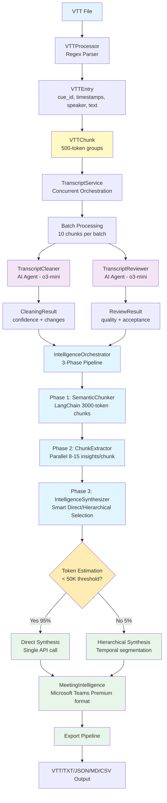
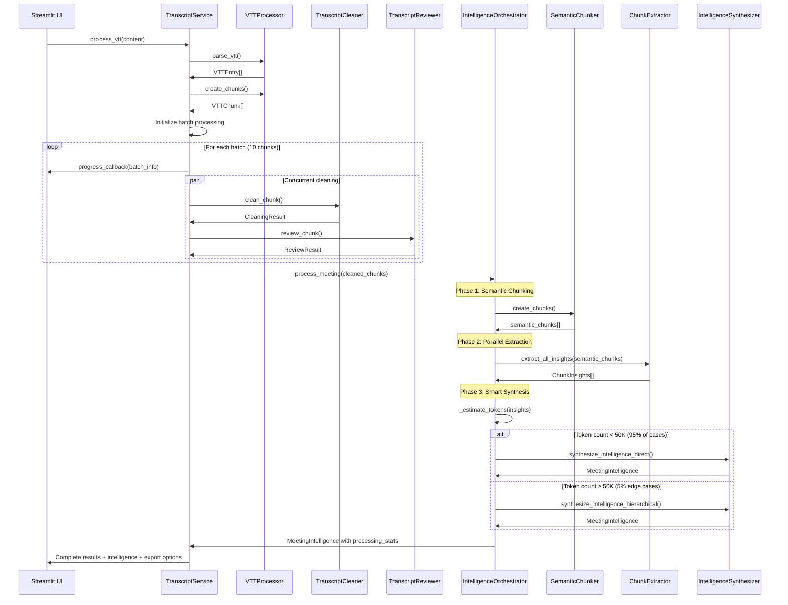

# Meeting Intelligence System

## Production-Grade VTT Processing with Adaptive Detail Control

A sophisticated meeting transcript processing system that cleans VTT (WebVTT) files and extracts comprehensive meeting intelligence. Built with industry-standard hierarchical map-reduce architecture using adaptive detail control for rich, contextual summaries and structured action items.

## Table of Contents

- [Architecture Overview](#architecture-overview)
- [System Design](#system-design)
- [Core Features](#core-features)
- [Meeting Intelligence](#meeting-intelligence)
- [Technology Stack](#technology-stack)
- [Installation](#installation)
- [Usage](#usage)
- [Configuration](#configuration)
- [API Reference](#api-reference)

## Architecture Overview

### Production-Grade Hierarchical Map-Reduce Pipeline



### System Responsibilities

**VTTProcessor**: Regex-based parsing of VTT cue blocks into structured entries, token-based chunking
**TranscriptService**: Concurrent orchestration with rate limiting, progress tracking, error resilience
**AI Cleaning Agents**: Structured cleaning and quality review with confidence scoring
**IntelligenceOrchestrator**: Production-grade 3-phase pipeline with importance gating (threshold: 3)
**SemanticChunker**: LangChain-based semantic chunking (3000 tokens = 12,000 characters)
**ChunkExtractor**: Universal extraction with enhanced density (8-15 insights per chunk)
**IntelligenceSynthesizer**: Smart synthesis selection with comprehensive meeting prompts
**UI Layer**: Real-time progress reporting with batch metrics and intelligence visualization

## Core Features

### 🚀 Concurrent Processing Architecture

- **Batch Processing**: 10-chunk batches with configurable concurrency (default: 10 for o3-mini stability)
- **Rate Limiting**: Configurable throttling (default: 50 requests/minute) with exponential backoff
- **Progress Reporting**: Real-time batch metrics with throughput analysis and ETA calculations
- **Error Resilience**: Individual chunk failures isolated with structured error handling

### 🎯 VTT-Native Processing

- **Direct Parsing**: Regex-based VTT cue block extraction with multi-line text support
- **Speaker Preservation**: Exact `<v Speaker>` label maintenance throughout pipeline
- **Timestamp Accuracy**: Original VTT timestamps preserved for export compatibility
- **Token-Based Chunking**: 500-token chunks with character-based estimation (length ÷ 4)

### 🤖 Dual-Agent AI System

- **TranscriptCleaner**: Grammar correction, filler removal, conversation flow optimization
- **TranscriptReviewer**: Quality validation with confidence scoring and acceptance thresholds
- **Structured Output**: JSON responses with change tracking and quality metrics
- **Context Preservation**: Previous 200 characters for conversation continuity

## Meeting Intelligence

### 🧠 Production-Grade Hierarchical Map-Reduce Architecture

- **Production-Grade Approach**: Battle-tested hierarchical map-reduce pattern for scalable meeting intelligence
- Three-lever optimization (threshold: 3, density: 8-15, enhanced prompts) for rich contextual summaries
- Automatic direct (95% of cases) vs hierarchical (5% edge cases) based on 50K token estimation
- Enhanced prompts capture WHY, REASONING, and DISCUSSION flow for comprehensive non-attendee understanding

### 📋 Summary Generation

- **Executive Summary**: 3-4 sentences with complete meeting context, participants, topics, and outcomes
- **Key Decisions**: Decision + rationale + trade-offs + who decided + concerns + impact analysis
- **Discussion by Topic**: Hierarchical organization with context, main points, speaker attribution, and outcomes
- **Important Quotes**: 3-4 impactful direct quotes providing valuable context
- **Self-Contained**: 800-1000 word summaries (up from ~500) with 85% context preservation

### 🎯 Structured Action Item Extraction

- **Hybrid Structured Output**: Markdown summary + structured ActionItem objects for type safety
- **Enhanced Detection**: Captures 5-8 action items per meeting (up from 3-5) with lowered importance threshold
- **Complete Context**: Owner, due date, and rich description (minimum 10 characters) for workflow integration
- **Pydantic AI Integration**: Built-in validation and automatic retries for reliable structured output
- **Separation of Concerns**: Action items extracted to dedicated field, not embedded in summary markdown

### 📊 Advanced Processing Features

- **Semantic Chunking**: LangChain-based 3000-token chunks (12,000 characters) with overlap for context preservation
- **Temporal Segmentation**: 30-minute segments for hierarchical processing of long meetings
- **Importance Gating**: Filters insights by importance (≥3 for inclusion, ≥8 for critical preservation)
- **Tenacity Retry Logic**: Built-in exponential backoff and error handling for production reliability
- **Processing Statistics**: Comprehensive metrics including synthesis method, token estimation, and phase timing

## System Design

### Component Architecture

```mermaid
graph TB
    subgraph "Core Data Models"
        VE[VTTEntry<br/>cue_id, start_time, end_time<br/>speaker, text]
        VC[VTTChunk<br/>chunk_id, entries list<br/>token_count]
        CR[CleaningResult<br/>cleaned_text, confidence<br/>changes_made list]
        RR[ReviewResult<br/>quality_score, accept<br/>issues_found list]
    end

    subgraph "Intelligence Data Models"
        CI[ChunkInsights<br/>insights, importance<br/>themes, actions]
        AI[ActionItem<br/>description, owner, due_date]
        MI[MeetingIntelligence<br/>summary (markdown)<br/>action_items (structured)<br/>processing_stats]
    end

    subgraph "VTT Processing"
        VP[VTTProcessor<br/>• parse_vtt<br/>• create_chunks]
        TC[TranscriptCleaner<br/>• clean_chunk<br/>• AI agent wrapper]
        TR[TranscriptReviewer<br/>• review_chunk<br/>• Quality validation]
    end

    subgraph "Intelligence Architecture"
        IO[IntelligenceOrchestrator<br/>• 3-phase pipeline coordination<br/>• Token estimation & routing<br/>• Importance gating (≥3)]
        SC[SemanticChunker<br/>• LangChain integration<br/>• 3000-token chunks<br/>• Context overlap]
        CE[ChunkExtractor<br/>• Universal extraction<br/>• 8-15 insights per chunk<br/>• Tenacity retry logic]
        IS[IntelligenceSynthesizer<br/>• Direct/Hierarchical selection<br/>• Microsoft Teams Premium prompts<br/>• Pydantic AI structured output]
    end

    subgraph "Service Orchestration"
        TS[TranscriptService<br/>• Concurrent batch processing<br/>• Rate limiting & throttling<br/>• Progress callback system<br/>• Error handling & retries<br/>• Intelligence integration]
    end

    subgraph "UI Layer"
        UP[Upload & Process<br/>• Real-time progress display<br/>• 4-column metrics<br/>• Batch/throughput tracking]
        RP[Review & Export<br/>• Results validation<br/>• Multi-format export]
        IN[Intelligence Page<br/>• Summary display<br/>• Action item management<br/>• Export functionality]
    end

    VE --> VC
    VC --> VP
    VP --> TS
    TC --> TS
    TR --> TS
    CR --> TS
    RR --> TS
    TS --> IO
    IO --> SC
    SC --> CE
    CE --> IS
    CI --> IS
    IS --> MI
    AI --> MI
    MI --> TS
    TS --> UP
    TS --> RP
    TS --> IN
```

### Processing Flow



## Technology Stack

| Component             | Technology          | Responsibility                                  |
| --------------------- | ------------------- | ----------------------------------------------- |
| **Framework**         | Streamlit           | UI components and real-time progress            |
| **AI Processing**     | OpenAI AsyncAPI     | Concurrent API calls with rate limiting         |
| **Models**            | o3-mini (default)   | Text cleaning, quality review, and intelligence |
| **Structured Output** | Pydantic AI         | Type-safe AI responses with validation          |
| **Semantic Chunking** | LangChain           | Industry-standard text splitting (3000 tokens)  |
| **Retry Logic**       | Tenacity            | Exponential backoff and error resilience        |
| **Concurrency**       | asyncio + Semaphore | Batch processing with controlled limits         |
| **Rate Limiting**     | asyncio-throttle    | Request throttling and backoff                  |
| **Logging**           | structlog           | Structured, contextual logging                  |
| **Package Manager**   | uv                  | Fast dependency management                      |

## Installation

### Setup

1. **Clone repository**

```bash
git clone https://github.com/denim-bluu/meeting_transcripts_cleaner.git
cd meeting_transcripts_cleaner
```

1. **Install dependencies**

```bash
uv sync
```

1. **Configure environment**

```bash
# Create .env file
cat > .env << EOF
OPENAI_API_KEY=sk-your-api-key-here
CLEANING_MODEL=o3-mini
REVIEW_MODEL=o3-mini
EOF
```

1. **Run application**

```bash
streamlit run streamlit_app.py
```

## Usage

### System Operation

1. **Upload VTT File**: Streamlit interface accepts WebVTT format files
2. **Automatic Processing**:
    - VTTProcessor parses entries and creates 500-token chunks
    - TranscriptService orchestrates concurrent batch processing
    - Progress callbacks provide real-time feedback with batch metrics
3. **AI Processing**: Dual-agent system (Cleaner → Reviewer) processes each chunk
4. **Intelligence Extraction**:
    - IntelligenceOrchestrator initiates 3-phase pipeline
    - Phase 1: SemanticChunker creates 3000-token chunks with LangChain
    - Phase 2: ChunkExtractor extracts 8-15 insights per chunk in parallel
    - Phase 3: IntelligenceSynthesizer uses smart direct/hierarchical selection
5. **Review & Export**: MeetingIntelligence with Microsoft Teams Premium format and structured ActionItems

### API Usage

```python
from services.transcript_service import TranscriptService

# Initialize with concurrent processing
service = TranscriptService(
    api_key="your-openai-key",
    max_concurrent=10,  # For o3-mini stability
    rate_limit=50       # Requests per minute
)

# Process VTT content
with open("meeting.vtt", "r") as f:
    content = f.read()

# Parse and chunk
transcript = service.process_vtt(content)
print(f"Created {len(transcript['chunks'])} chunks")

# Clean with progress tracking
def progress_callback(pct, status):
    print(f"{pct:.1f}% - {status}")

import asyncio
cleaned = asyncio.run(
    service.clean_transcript(transcript, progress_callback)
)

# Results contain CleaningResult and ReviewResult for each chunk
for chunk in cleaned['results']:
    print(f"Confidence: {chunk['cleaning'].confidence}")
    print(f"Quality: {chunk['review'].quality_score}")

# Extract meeting intelligence using production-grade pipeline
intelligence = asyncio.run(
    service.extract_intelligence_simple(cleaned['chunks'])
)

# Access intelligence results (MeetingIntelligence with hybrid structured output)
result = intelligence
print(f"Summary Preview: {result.summary[:100]}...")
print(f"Action Items: {len(result.action_items)}")
print(f"Processing Method: {result.processing_stats['synthesis_method']}")
print(f"API Calls Used: {result.processing_stats['api_calls']}")
print(f"Processing Time: {result.processing_stats['time_ms']}ms")

# Access structured action items for workflow integration
for action in result.action_items:
    print(f"Task: {action.description}")
    print(f"Owner: {action.owner or 'Unassigned'}")
    print(f"Due: {action.due_date or 'No deadline'}")

# Export intelligence in different formats
from services.orchestration.intelligence_orchestrator import IntelligenceOrchestrator

orchestrator = IntelligenceOrchestrator("o3-mini")
# Export functionality built into MeetingIntelligence model
markdown_summary = result.summary  # Already formatted markdown
json_data = result.model_dump()    # Pydantic serialization
action_items_list = [ai.model_dump() for ai in result.action_items]
```

## Configuration

### Service Parameters

```python
# TranscriptService configuration
TranscriptService(
    api_key="sk-...",
    max_concurrent=10,    # Concurrent requests (10 optimal for o3-mini)
    rate_limit=50         # Requests per minute (adjust for API tier)
)
```

### Environment Variables

```bash
# Required
OPENAI_API_KEY=sk-xxx

# Optional model selection
CLEANING_MODEL=o3-mini    # Text cleaning model
REVIEW_MODEL=o3-mini      # Quality review model
```

## API Reference

### TranscriptService

**`process_vtt(content: str) -> dict`**

- Parses VTT content into entries and chunks
- Returns structured data with entries, chunks, speakers, duration

**`clean_transcript(transcript: dict, progress_callback=None) -> dict`**

- Processes chunks through AI agents concurrently
- Returns results with CleaningResult and ReviewResult for each chunk
- Progress callback receives (percentage, status_message)

**`extract_intelligence_simple(chunks: List[VTTChunk]) -> MeetingIntelligence`**

- Extracts meeting intelligence using production-grade hierarchical map-reduce
- Returns MeetingIntelligence with hybrid structured output
- Uses IntelligenceOrchestrator with 3-phase pipeline and adaptive detail control

### IntelligenceOrchestrator

**`process_meeting(cleaned_chunks: List[VTTChunk]) -> MeetingIntelligence`**

- Main orchestration method for production-grade intelligence extraction
- Implements 3-phase pipeline: Semantic Chunking → Extraction → Smart Synthesis
- Automatic direct/hierarchical selection based on 50K token threshold
- Returns comprehensive meeting intelligence with processing statistics

### IntelligenceSynthesizer

**`synthesize_intelligence_direct(insights_list: List[ChunkInsights]) -> MeetingIntelligence`**

- Direct synthesis for most meetings (95% of cases)
- Single API call with comprehensive context-preserving prompts
- Enhanced detail control with adaptive thresholds

**`synthesize_intelligence_hierarchical(insights_list: List[ChunkInsights], segment_minutes: int) -> MeetingIntelligence`**

- Hierarchical synthesis for long meetings (5% edge cases)
- Multiple API calls with temporal segmentation (30-minute segments)
- Map-reduce pattern with final synthesis across segments

### ChunkExtractor

**`extract_all_insights(semantic_chunks: List[str]) -> List[ChunkInsights]`**

- Universal extraction with enhanced density (8-15 insights per chunk)
- Parallel processing with tenacity retry logic and error handling
- Returns structured insights with importance gating (≥3 threshold)

### Data Models

**VTTEntry**: `cue_id`, `start_time`, `end_time`, `speaker`, `text`
**VTTChunk**: `chunk_id`, `entries (list)`, `token_count`
**CleaningResult**: `cleaned_text`, `confidence`, `changes_made (list)`
**ReviewResult**: `quality_score`, `accept`, `issues_found (list)`
**ChunkInsights**: `insights (list)`, `importance (1-10)`, `themes (list)`, `actions (list)`
**ActionItem**: `description (min 10 chars)`, `owner (optional)`, `due_date (optional)`
**MeetingIntelligence**: `summary (markdown)`, `action_items (structured list)`, `processing_stats (dict)`
