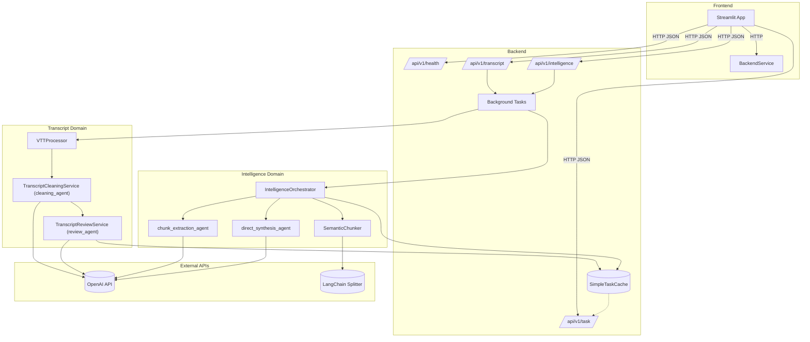
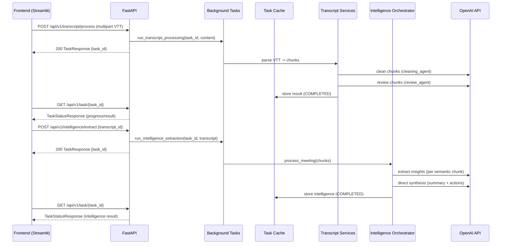

# Meeting Transcript Cleaner (with AI Intelligence)

Production-ready system that turns raw WebVTT meeting transcripts into:

- Cleaned, readable transcripts with speaker attribution
- Quality-reviewed output
- Comprehensive meeting intelligence (summary and action items)

The system is intentionally simplified: there are no “detail level” settings or conditional prompts. Intelligence extraction always uses a single high-quality flow.

---

## Key Features

- FastAPI backend with async background task processing and progress polling
- Streamlit frontend (3-step UX: Upload → Review → Intelligence)
- Pydantic AI agents for:
    - Cleaning speech-to-text artifacts
    - Reviewing quality
    - Extracting insights and synthesizing the summary
- In-memory task cache with TTL and cleanup
- Dockerized services and Justfile dev workflows

---

## System Architecture

High-level architecture

Data flow

---

## Prerequisites

- Python 3.11+
- OpenAI API access
- macOS/Linux (Windows should work but not actively tested)
- Docker (for containerized deployment)
- just (optional, for local dev convenience)

---

## Configuration

The backend reads both:

- Environment variable OPENAI_API_KEY
- backend/.env (loaded via pydantic-settings)

Minimal backend/.env example (create minutes_cleaner/backend/.env):

OPENAI_API_KEY=sk-xxx
environment=development
log_level=INFO

# Optional tuning

task_ttl_hours=1
cleanup_interval_minutes=10
max_concurrent_tasks=50
rate_limit_per_minute=50

# Model names (default to o3-mini everywhere)

cleaning_model=o3-mini
review_model=o3-mini
insights_model=o3-mini
synthesis_model=o3-mini

Frontend needs BACKEND_URL set when you run it (defaults to http://localhost:8000 in dev). The just recipes and docker-compose set this for you.

---

## Local Development (with just)

Install dependencies (uses uv):

    just install
    # or, with dev deps:
    just install-dev

Run backend:

    just run-backend
    # Backend on http://localhost:8000
    # OpenAPI docs at http://localhost:8000/docs (dev only)

Run frontend:

    just run-frontend
    # Frontend on http://localhost:8501

Run both in parallel:

    just dev

Health checks and status:

    just health
    just status

Tests:

    just test
    just test-backend

Cleanup:

    just clean

---

## Docker

Build and run with docker-compose:

    just docker-build
    just docker-run

- Backend: http://localhost:8000
- Frontend: http://localhost:8501

---

## End-to-End Flow

1. Upload a WebVTT file in the frontend (Upload & Process page)
2. The backend:
    - Parses and chunks the VTT (no external API calls yet)
    - Cleans each chunk (AI agent)
    - Reviews each cleaned chunk (AI agent)
    - Streams progress updates to the task cache
3. Review the cleaned transcript (Review page)
4. Extract Intelligence (Intelligence page)
    - Single, comprehensive flow
    - No detail levels or custom instruction parameters
    - Produces summary + action_items with processing stats

You can try the included sample:

- minutes_cleaner/test_meeting.vtt

---

## API

Base URL (dev): http://localhost:8000

Health

- GET /api/v1/health
    - Returns overall service health and model configuration

Transcript Processing

- POST /api/v1/transcript/process
    - Content-Type: multipart/form-data
    - Form field: file=yourfile.vtt
    - Returns TaskResponse: { task_id, status, message }
    - Processing runs in background; poll the task for results

Intelligence Extraction

- POST /api/v1/intelligence/extract
    - JSON body: { "transcript_id": "<task_id_from_transcript_processing>" }
    - Returns TaskResponse: { task_id, status, message }
    - Intelligence extraction runs in background; poll the task for results

Task Management

- GET /api/v1/task/{task_id}
    - Returns TaskStatusResponse with fields:
        - task_id, type, status, progress, message,
          created_at, updated_at, result, error
- DELETE /api/v1/task/{task_id}
    - Removes task from cache (does not cancel a running background job)

---

## API Examples

Start transcript processing (multipart upload):

    curl -s -X POST \
      -F "file=@./test_meeting.vtt" \
      http://localhost:8000/api/v1/transcript/process

Response (TaskResponse):

    {
      "task_id": "b1d2...e3",
      "status": "processing",
      "message": "VTT file received, processing started"
    }

Poll task status:

    curl -s http://localhost:8000/api/v1/task/b1d2...e3

If completed, result includes cleaned transcript data:

    {
      "task_id": "b1d2...e3",
      "type": "transcript_processing",
      "status": "completed",
      "progress": 1.0,
      "message": "Transcript processing completed",
      "created_at": "...",
      "updated_at": "...",
      "result": {
        "entries": [...],
        "chunks": [...],
        "speakers": ["John", "Sarah", "Mike"],
        "duration": 35.0,
        "cleaned_chunks": [...],
        "review_results": [...],
        "final_transcript": "...",
        "processing_stats": { ... }
      }
    }

Start intelligence extraction (single high-quality flow):

    curl -s -X POST \
      -H "Content-Type: application/json" \
      -d '{"transcript_id": "b1d2...e3"}' \
      http://localhost:8000/api/v1/intelligence/extract

Response (TaskResponse):

    {
      "task_id": "c9a8...f0",
      "status": "processing",
      "message": "Comprehensive intelligence extraction started"
    }

Poll intelligence task:

    curl -s http://localhost:8000/api/v1/task/c9a8...f0

Completed intelligence result structure (top-level convenience fields are included):

    {
      "task_id": "c9a8...f0",
      "type": "intelligence_extraction",
      "status": "completed",
      "result": {
        "intelligence": {
          "summary": "### Topic A ...",
          "action_items": [
            { "description": "...", "owner": "Sarah", "due_date": "Next Tuesday" }
          ],
          "processing_stats": { "time_ms": 6200, ... }
        },
        "summary": "### Topic A ...",
        "action_items": [
          { "description": "...", "owner": "Sarah", "due_date": "Next Tuesday" }
        ],
        "processing_stats": { "time_ms": 6200, ... }
      }
    }

Note: There are no detail levels and no custom instruction parameters — requests only need transcript_id.

---

## Notes and Limitations

- Task state is stored in memory and expires automatically (TTL). This is perfect for local and container scenarios but not durable. Use the task ID immediately after submission to poll results.
- OpenAPI docs are only available in non-production environments at /docs.
- Model names default to o3-mini across the system; override via backend/.env if needed.
