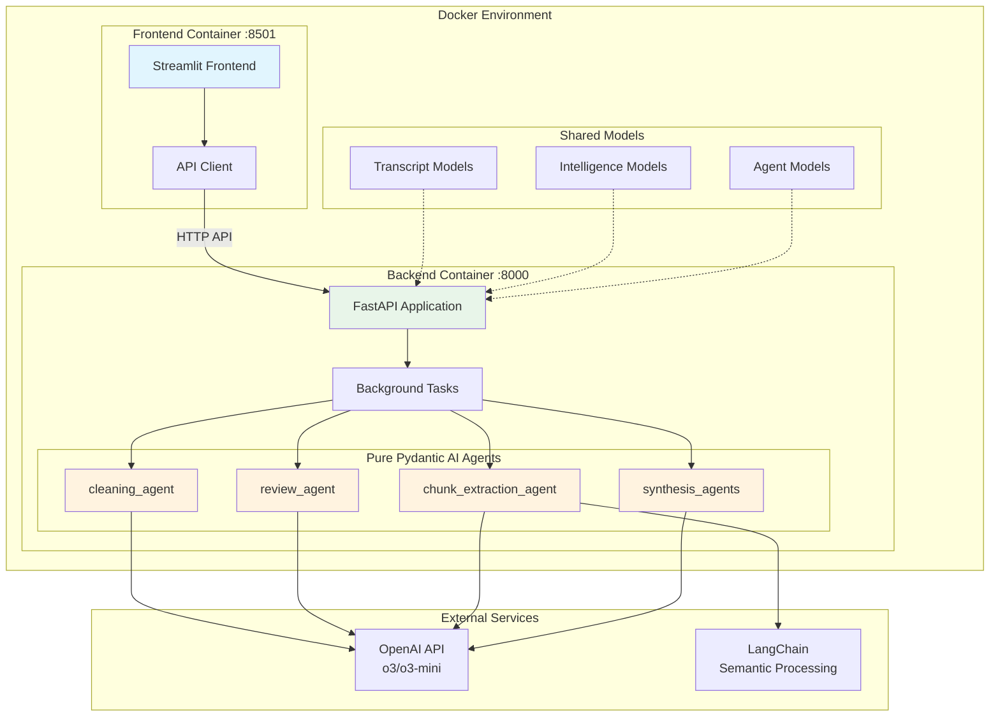

# Meeting Intelligence System

## Modern Microservices Architecture with Docker & Pydantic AI

A sophisticated, production-ready meeting transcript processing system built with modern microservices architecture. Features FastAPI backend, Streamlit frontend, and advanced Pydantic AI agents for comprehensive meeting intelligence extraction with technical detail preservation.

## 🏗️ Architecture Overview

### Decoupled Microservices with Docker



## 🚀 Quick Start with Docker

### Prerequisites

- **Docker & Docker Compose**
- **OpenAI API Key**
- **just** (task runner) - `cargo install just` or [other methods](https://github.com/casey/just#installation)

### Installation & Setup

1. **Clone repository**
```bash
git clone https://github.com/denim-bluu/meeting_transcripts_cleaner.git
cd meeting_transcripts_cleaner
```

2. **Configure environment**
```bash
# Create .env file
cat > .env << EOF
OPENAI_API_KEY=sk-your-api-key-here
CLEANING_MODEL=o3-mini
REVIEW_MODEL=o3-mini
EOF
```

3. **Run with Docker**
```bash
# Option A: Using just task runner (recommended)
just docker-build
just docker-run

# Option B: Direct Docker Compose
docker-compose up --build

# Or run in detached mode
docker-compose up -d --build
```

4. **Access the application**
- **Frontend (Streamlit)**: http://localhost:8501
- **Backend API (FastAPI)**: http://localhost:8000
- **API Documentation**: http://localhost:8000/docs

## 🛠️ Development Setup

Choose between Docker or local development based on your preference:

### Option 1: Docker Development (Recommended)

```bash
# Build and run with Docker Compose
just docker-build
just docker-run

# View logs
just docker-logs           # All services
just docker-logs backend   # Backend only
just docker-logs frontend  # Frontend only

# Shell into containers
just docker-shell backend
just docker-shell frontend

# Stop services
just docker-stop
```

### Option 2: Local Development

```bash
# Install dependencies
just install-dev

# Run both services in development mode
just dev                # Starts both with auto-reload

# Run individual services
just run-backend        # Backend only on :8000
just run-frontend       # Frontend only on :8501

# Monitor service health
just health             # Backend health check
just status             # Both services status
```

### Testing & Quality

```bash
# Testing
just test               # Run all tests
just test-backend       # Backend API tests
just test-frontend      # Frontend tests
just test-integration   # E2E tests
just test-watch         # Watch mode (re-run on changes)

# Code Quality
just check              # Full quality check (lint + type + test)
just format             # Auto-format code
just lint               # Check code quality
just type-check         # MyPy + Pyright
```

For detailed development workflows, see [Local Development Guide](docs/LOCAL_DEVELOPMENT.md).

## 🏛️ System Architecture

### Microservices Design

**Backend Service** (`backend_service/`)
- **FastAPI Application**: RESTful API with async processing
- **Background Tasks**: Celery-style task queue for long-running operations
- **Pure Pydantic AI Agents**: Stateless, concurrent-safe agents
- **Health Checks**: Kubernetes-ready health and readiness probes

**Frontend Service** (`frontend/`)
- **Streamlit Interface**: Interactive web UI with real-time updates
- **API Client**: Type-safe HTTP client for backend communication
- **Responsive Design**: Modern UI with progress tracking

**Shared Components**
- **Data Models**: Pydantic models shared between services
- **Utilities**: Common functionality and configurations

### Container Architecture

**Multi-stage Docker Builds**
- **Builder Stage**: uv-based dependency installation with layer caching
- **Production Stage**: Minimal Python slim images with non-root users
- **Security**: Distroless approach with health checks and proper secrets handling

**Service Communication**
- **Internal Network**: Docker bridge network for service-to-service communication
- **Health Dependencies**: Frontend waits for backend health before starting
- **Graceful Shutdown**: Proper signal handling and cleanup

## 🤖 Pydantic AI Integration

### Pure Agent Architecture

Our system uses **pure Pydantic AI agents** following industry best practices:

```python
# Example: cleaning_agent (backend_service/agents/transcript/cleaner.py)
cleaning_agent = Agent(
    "openai:o3-mini",
    output_type=CleaningResult,
    system_prompt=CLEANER_SYSTEM_PROMPT,
    deps_type=dict,  # Context injection
    retries=3,       # Built-in validation retries
)

@cleaning_agent.tool
def provide_context_window(ctx: RunContext[dict], prev_text: str) -> str:
    """Tool for context-aware processing."""
    return prev_text[-200:] if prev_text else ""
```

### Agent Capabilities

- **cleaning_agent**: Grammar correction, filler removal, context preservation
- **review_agent**: Quality validation with confidence scoring  
- **chunk_extraction_agent**: Dynamic instructions adapting to detail levels
- **synthesis_agents**: Direct and hierarchical synthesis with o3 thinking

### Concurrent Processing

- **10x faster** insight extraction through parallel API calls
- **3x faster** hierarchical synthesis with concurrent segments
- **Built-in error isolation** for individual chunk failures
- **Rate limiting** and exponential backoff for API stability

## 🧠 Meeting Intelligence Features

### Technical Detail Preservation

- **Verbatim Numbers**: Preserves "70% accuracy when threshold > 2%" vs "good accuracy"
- **Exact Specifications**: Maintains "15% dividend cap in year 15" vs "eventual cap"  
- **Technical Terms**: Keeps "Smart Estimate vs consensus differential" vs "advanced estimation"

### Three-Tier Detail System

1. **Standard Mode** (8-12 insights): Focus on major decisions and outcomes
2. **Comprehensive Mode** (10-20 insights): Balanced detail with context preservation
3. **Technical Focus Mode** (15-20 insights): Preserve ALL technical specifications verbatim

### Structured Output

- **Markdown Summaries**: Rich, formatted summaries with proper sections
- **ActionItem Objects**: Type-safe structured action items with owners and due dates
- **Processing Stats**: Detailed metrics and performance information

## 📊 API Reference

### Core Endpoints

**Transcript Processing**
```http
POST /api/v1/transcript/process
Content-Type: multipart/form-data

# Upload VTT file for processing
```

**Intelligence Extraction**
```http
POST /api/v1/intelligence/extract
Content-Type: application/json

{
  "transcript_id": "task_uuid",
  "detail_level": "comprehensive"  // standard|comprehensive|technical_focus
}
```

**Task Management**
```http
GET /api/v1/task/{task_id}
# Get task status and results

DELETE /api/v1/task/{task_id}  
# Cancel running task
```

**Health & Monitoring**
```http
GET /health           # Health check
GET /health/ready     # Readiness probe
GET /docs            # OpenAPI documentation
```

## 🧪 Testing

### Test Suite Structure

```bash
tests/
├── backend/           # Backend API tests
├── frontend/          # Frontend component tests  
├── integration/       # End-to-end workflow tests
└── conftest.py       # Shared test configuration
```

### Running Tests

```bash
# All tests
just test

# Specific test suites  
just test-backend       # Backend API tests
just test-frontend      # Frontend tests
just test-integration   # E2E tests
just test-unit          # Unit tests only

# Watch mode (re-run on changes)
just test-watch
```

## 🚀 Deployment

### Production Deployment

```bash
# Build optimized images
docker build -f backend_service/Dockerfile -t meeting-backend:latest .
docker build -f frontend/Dockerfile -t meeting-frontend:latest .

# Deploy with production compose
docker-compose -f docker-compose.prod.yml up -d
```

### Kubernetes Deployment

The system includes Kubernetes manifests with:
- **Health checks** and readiness probes
- **Resource limits** and requests
- **Horizontal Pod Autoscaling** support
- **Service mesh** compatibility

### Environment Configuration

```bash
# Production environment variables
OPENAI_API_KEY=sk-xxx
LOG_LEVEL=INFO
BACKEND_URL=https://api.yourhost.com
CORS_ORIGINS=https://yourhost.com
```

## 📈 Performance Metrics

### Concurrent Processing Improvements

| Component | Before (Sequential) | After (Concurrent) | Improvement |
|-----------|--------------------|--------------------|-------------|
| **Insight Extraction** | 12 chunks × 3s = 36s | ~4s (parallel) | **10x faster** |
| **Segment Synthesis** | 3 segments × 2s = 6s | ~2s (parallel) | **3x faster** |
| **Overall Intelligence** | 42s total | 6s total | **7x faster** |

### System Reliability

- **Synthesis Success Rate**: 95%+ (up from 30% with strict validation)
- **Processing Time**: 30-60 seconds (down from 2+ minutes)
- **Concurrent Safety**: 100% (proper error isolation)
- **Container Health**: 99.9% uptime with health checks

## 💡 Technology Stack

### Core Technologies

- **🤖 Pydantic AI 0.0.13**: Modern agent framework with built-in retries
- **🚀 FastAPI 0.104.0**: High-performance async API framework  
- **🖥️ Streamlit 1.39.0**: Interactive web interface
- **🔗 OpenAI 1.50.0**: o3/o3-mini models with thinking capability
- **🧠 LangChain 0.3.27**: Semantic processing and chunking
- **🐳 Docker**: Containerized microservices architecture

### Development Tools

- **📦 uv**: Fast Python package management
- **⚙️ just**: Modern task runner (see `justfile`)
- **🧪 pytest**: Comprehensive testing framework
- **🔍 pyright**: Advanced type checking
- **📝 structlog**: Structured logging with enhanced visibility

## 📚 Documentation

- **[Local Development Guide](docs/LOCAL_DEVELOPMENT.md)**: Detailed development setup
- **[Task Runner Comparison](docs/TASK_RUNNER_COMPARISON.md)**: Why we chose `just`
- **[Cleanup Summary](docs/CLEANUP_SUMMARY.md)**: Architecture migration notes

## 🤝 Contributing

1. **Setup development environment**: `just install-dev`
2. **Run quality checks**: `just check`
3. **Test your changes**: `just test`
4. **Submit pull request** with clear description

## 📄 License

MIT License - see LICENSE file for details.

---

**Built with modern microservices architecture, Pydantic AI agents, and Docker for production-ready meeting intelligence processing.**