# Meeting Intelligence System

## AI-Powered VTT Processing with Meeting Intelligence Extraction

A comprehensive meeting transcript processing system that cleans VTT (WebVTT) files and extracts actionable intelligence including summaries, action items, and key decisions. Built with concurrent dual-agent AI architecture for enterprise-grade reliability.

## Table of Contents

- [Architecture Overview](#architecture-overview)
- [System Design](#system-design)
- [Core Features](#core-features)
- [Meeting Intelligence](#meeting-intelligence)
- [Technology Stack](#technology-stack)
- [Installation](#installation)
- [Usage](#usage)
- [Configuration](#configuration)
- [API Reference](#api-reference)

## Architecture Overview

### Concurrent Processing Pipeline

```mermaid
graph TB
    A[VTT File] --> B[VTTProcessor<br/>Regex Parser]
    B --> C[VTTEntry<br/>cue_id, timestamps, speaker, text]
    C --> D[VTTChunk<br/>500-token groups]
    
    D --> E[TranscriptService<br/>Concurrent Orchestration]
    E --> F[Batch Processing<br/>10 chunks per batch]
    
    F --> G[TranscriptCleaner<br/>AI Agent - GPT-4]
    F --> H[TranscriptReviewer<br/>AI Agent - GPT-4]
    
    G --> I[CleaningResult<br/>confidence + changes]
    H --> J[ReviewResult<br/>quality + acceptance]
    
    I --> M[IntelligenceService<br/>Meeting Intelligence]
    J --> M
    
    M --> N[Context Windows<br/>±200 char overlap]
    N --> O[Parallel Extraction]
    O --> P[SummaryExtractor<br/>AI Agent - GPT-4]
    O --> Q[ActionItemExtractor<br/>AI Agent - GPT-4]
    
    P --> R[Synthesis Agent<br/>GPT-4]
    Q --> R
    
    R --> S[IntelligenceResult<br/>summaries + actions]
    S --> T[Export Pipeline]
    T --> U[VTT/TXT/JSON/MD/CSV Output]

    style A fill:#e3f2fd
    style D fill:#fff9c4
    style G fill:#f3e5f5
    style H fill:#f3e5f5
    style M fill:#e1f5fe
    style P fill:#e1f5fe
    style Q fill:#e1f5fe
    style R fill:#e1f5fe
    style T fill:#e8f5e9
```



### System Responsibilities

**VTTProcessor**: Regex-based parsing of VTT cue blocks into structured entries, token-based chunking
**TranscriptService**: Concurrent orchestration with rate limiting, progress tracking, error resilience  
**AI Cleaning Agents**: Structured cleaning and quality review with confidence scoring
**IntelligenceService**: Meeting intelligence extraction with parallel MapReduce processing
**Intelligence Agents**: Summary extraction, action item identification, and synthesis
**UI Layer**: Real-time progress reporting with batch metrics and intelligence visualization

## Core Features

### 🚀 Concurrent Processing Architecture

- **Batch Processing**: 10-chunk batches with configurable concurrency (default: 10 for o3-mini stability)
- **Rate Limiting**: Configurable throttling (default: 50 requests/minute) with exponential backoff
- **Progress Reporting**: Real-time batch metrics with throughput analysis and ETA calculations
- **Error Resilience**: Individual chunk failures isolated with structured error handling

### 🎯 VTT-Native Processing

- **Direct Parsing**: Regex-based VTT cue block extraction with multi-line text support
- **Speaker Preservation**: Exact `<v Speaker>` label maintenance throughout pipeline
- **Timestamp Accuracy**: Original VTT timestamps preserved for export compatibility
- **Token-Based Chunking**: 500-token chunks with character-based estimation (length ÷ 4)

### 🤖 Dual-Agent AI System

- **TranscriptCleaner**: Grammar correction, filler removal, conversation flow optimization
- **TranscriptReviewer**: Quality validation with confidence scoring and acceptance thresholds
- **Structured Output**: JSON responses with change tracking and quality metrics
- **Context Preservation**: Previous 200 characters for conversation continuity

## Meeting Intelligence

### 🧠 Intelligent Extraction System

- **Hierarchical Processing**: MapReduce pattern with sliding context windows to overcome LLM context limitations
- **Parallel Extraction**: Concurrent processing of summaries and action items across all chunks
- **Context Enrichment**: ±200 character sliding windows preserve cross-boundary information
- **Selective Review**: Confidence-based review triggers only when needed (<0.8 confidence or critical content)

### 📋 Summary Generation

- **Executive Summary**: Concise overview under 500 characters for quick consumption
- **Detailed Summary**: Comprehensive narrative under 2000 characters with full context
- **Key Takeaways**: 3-10 bullet points highlighting main discussion points
- **Multiple Formats**: JSON, Markdown, and structured exports for different use cases

### 🎯 Action Item Detection

- **Smart Extraction**: Identifies tasks, assignments, and commitments using AI understanding
- **Owner Detection**: Automatically identifies responsible parties when mentioned
- **Deadline Capture**: Extracts due dates and timeframes from natural language
- **Confidence Scoring**: Each action item includes confidence rating and review flags
- **Critical Flagging**: Automatically identifies high-impact items (financial, legal, strategic)
- **Source Tracking**: Maintains traceability to original transcript chunks

### 📊 Export & Integration

- **Multi-Format Export**: JSON (complete data), Markdown (reports), CSV (action items)
- **Real-Time Preview**: Live preview of exports before download
- **Confidence Indicators**: Visual cues for items requiring review
- **Processing Statistics**: Detailed metrics on extraction quality and performance

## System Design

### Component Architecture

```mermaid
graph TB
    subgraph "Data Models"
        VE[VTTEntry<br/>cue_id, start_time, end_time<br/>speaker, text]
        VC[VTTChunk<br/>chunk_id, entries list<br/>token_count]
        CR[CleaningResult<br/>cleaned_text, confidence<br/>changes_made list]
        RR[ReviewResult<br/>quality_score, accept<br/>issues_found list]
        AI[ActionItem<br/>description, owner, deadline<br/>confidence, needs_review]
        CS[ChunkSummary<br/>key_points, decisions<br/>topics, speakers]
        IR[IntelligenceResult<br/>summaries, actions<br/>confidence, stats]
    end

    subgraph "Core Processing"
        VP[VTTProcessor<br/>• parse_vtt<br/>• create_chunks]
        TC[TranscriptCleaner<br/>• clean_chunk<br/>• AI agent wrapper]
        TR[TranscriptReviewer<br/>• review_chunk<br/>• Quality validation]
    end

    subgraph "Intelligence Processing"
        IS[IntelligenceService<br/>• Context windows<br/>• Parallel extraction<br/>• Synthesis orchestration]
        SE[SummaryExtractor<br/>• Key point extraction<br/>• Decision identification]
        AE[ActionItemExtractor<br/>• Task identification<br/>• Owner detection]
        SY[IntelligenceSynthesizer<br/>• Deduplication<br/>• Final synthesis]
    end

    subgraph "Service Orchestration"
        TS[TranscriptService<br/>• Concurrent batch processing<br/>• Rate limiting & throttling<br/>• Progress callback system<br/>• Error handling & retries<br/>• Intelligence integration]
    end

    subgraph "UI Layer"
        UP[Upload & Process<br/>• Real-time progress display<br/>• 4-column metrics<br/>• Batch/throughput tracking]
        RP[Review & Export<br/>• Results validation<br/>• Multi-format export]
        IN[Intelligence Page<br/>• Summary display<br/>• Action item management<br/>• Export functionality]
    end

    VE --> VC
    VC --> VP
    VP --> TS
    TC --> TS
    TR --> TS
    CR --> TS
    RR --> TS
    TS --> IS
    IS --> SE
    IS --> AE
    SE --> SY
    AE --> SY
    SY --> IR
    IR --> TS
    TS --> UP
    TS --> RP
    TS --> IN
```



### Processing Flow


## Technology Stack

| Component           | Technology                 | Responsibility                           |
| ------------------- | -------------------------- | ---------------------------------------- |
| **Framework**       | Streamlit                  | UI components and real-time progress    |
| **AI Processing**   | OpenAI AsyncAPI            | Concurrent API calls with rate limiting  |
| **Models**          | o3-mini (default)          | Text cleaning and quality review         |
| **Concurrency**     | asyncio + Semaphore        | Batch processing with controlled limits  |
| **Rate Limiting**   | asyncio-throttle           | Request throttling and backoff           |
| **Logging**         | structlog                  | Structured, contextual logging           |
| **Package Manager** | uv                         | Fast dependency management               |

## Installation

### Setup

1. **Clone repository**

```bash
git clone https://github.com/denim-bluu/meeting_transcripts_cleaner.git
cd meeting_transcripts_cleaner
```

1. **Install dependencies**

```bash
uv sync
```

1. **Configure environment**

```bash
# Create .env file
cat > .env << EOF
OPENAI_API_KEY=sk-your-api-key-here
CLEANING_MODEL=o3-mini
REVIEW_MODEL=o3-mini
EOF
```

1. **Run application**

```bash
streamlit run streamlit_app.py
```

## Usage

### System Operation

1. **Upload VTT File**: Streamlit interface accepts WebVTT format files
2. **Automatic Processing**:
   - VTTProcessor parses entries and creates 500-token chunks
   - TranscriptService orchestrates concurrent batch processing
   - Progress callbacks provide real-time feedback with batch metrics
3. **AI Processing**: Dual-agent system (Cleaner → Reviewer) processes each chunk
4. **Intelligence Extraction**: 
   - IntelligenceService creates sliding context windows
   - Parallel extraction of summaries and action items
   - Synthesis into comprehensive meeting intelligence
5. **Review & Export**: Intelligence results with confidence scoring and multi-format export

### API Usage

```python
from services.transcript_service import TranscriptService

# Initialize with concurrent processing
service = TranscriptService(
    api_key="your-openai-key",
    max_concurrent=10,  # For o3-mini stability
    rate_limit=50       # Requests per minute
)

# Process VTT content
with open("meeting.vtt", "r") as f:
    content = f.read()

# Parse and chunk
transcript = service.process_vtt(content)
print(f"Created {len(transcript['chunks'])} chunks")

# Clean with progress tracking
def progress_callback(pct, status):
    print(f"{pct:.1f}% - {status}")

import asyncio
cleaned = asyncio.run(
    service.clean_transcript(transcript, progress_callback)
)

# Results contain CleaningResult and ReviewResult for each chunk
for chunk in cleaned['results']:
    print(f"Confidence: {chunk['cleaning'].confidence}")
    print(f"Quality: {chunk['review'].quality_score}")

# Extract meeting intelligence
intelligence = asyncio.run(
    service.extract_intelligence(cleaned)
)

# Access intelligence results
result = intelligence['intelligence']
print(f"Executive Summary: {result.executive_summary}")
print(f"Action Items: {len(result.action_items)}")
print(f"Confidence: {result.confidence_score}")

# Export intelligence in different formats
from services.intelligence_service import IntelligenceService

intel_service = IntelligenceService("your-openai-key")
markdown_report = intel_service.export_markdown(result)
json_data = intel_service.export_json(result)
csv_actions = intel_service.export_csv(result)
```

## Configuration

### Service Parameters

```python
# TranscriptService configuration
TranscriptService(
    api_key="sk-...",
    max_concurrent=10,    # Concurrent requests (10 optimal for o3-mini)
    rate_limit=50         # Requests per minute (adjust for API tier)
)
```

### Environment Variables

```bash
# Required
OPENAI_API_KEY=sk-xxx

# Optional model selection  
CLEANING_MODEL=o3-mini    # Text cleaning model
REVIEW_MODEL=o3-mini      # Quality review model
```

## API Reference

### TranscriptService

**`process_vtt(content: str) -> dict`**

- Parses VTT content into entries and chunks
- Returns structured data with entries, chunks, speakers, duration

**`clean_transcript(transcript: dict, progress_callback=None) -> dict`**

- Processes chunks through AI agents concurrently
- Returns results with CleaningResult and ReviewResult for each chunk
- Progress callback receives (percentage, status_message)

**`extract_intelligence(transcript: dict) -> dict`**

- Extracts meeting intelligence from cleaned transcript chunks
- Returns transcript with added 'intelligence' key containing IntelligenceResult
- Uses parallel MapReduce processing with context windows

### IntelligenceService

**`extract_intelligence(chunks: List[VTTChunk]) -> IntelligenceResult`**

- Main orchestration method for intelligence extraction
- Creates sliding context windows and processes in parallel
- Returns comprehensive meeting intelligence with confidence scoring

**`export_json(result: IntelligenceResult) -> str`**
**`export_markdown(result: IntelligenceResult) -> str`**  
**`export_csv(result: IntelligenceResult) -> str`**

- Export intelligence results in JSON, Markdown, or CSV formats
- Markdown includes formatted report with action items and summaries
- CSV focuses on action items with status and assignment details

### Data Models

**VTTEntry**: `cue_id`, `start_time`, `end_time`, `speaker`, `text`  
**VTTChunk**: `chunk_id`, `entries (list)`, `token_count`  
**CleaningResult**: `cleaned_text`, `confidence`, `changes_made (list)`  
**ReviewResult**: `quality_score`, `accept`, `issues_found (list)`  
**ActionItem**: `description`, `owner`, `deadline`, `confidence`, `needs_review`, `is_critical`  
**ChunkSummary**: `key_points`, `decisions`, `topics`, `speakers`, `confidence`  
**IntelligenceResult**: `executive_summary`, `detailed_summary`, `bullet_points`, `action_items`, `confidence_score`
