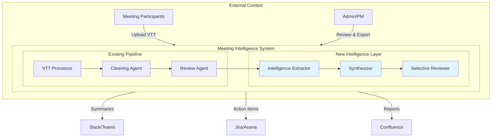
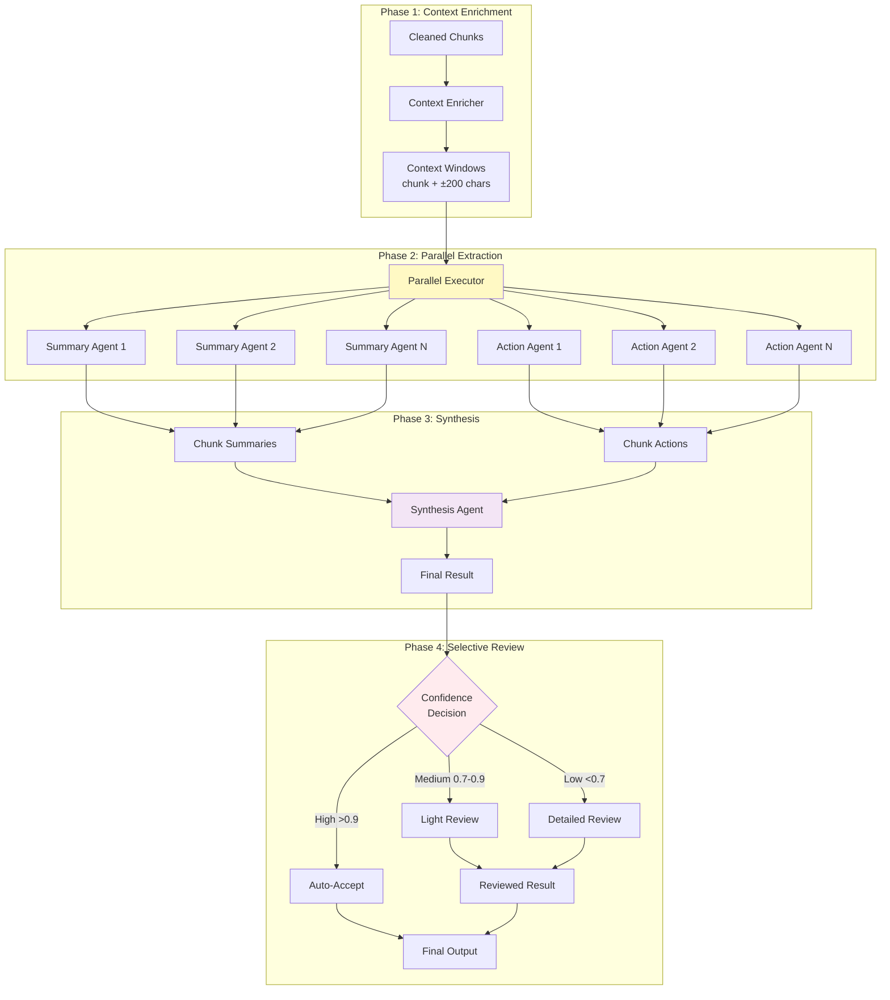

# Meeting Intelligence System Design

## 1. The Goal

### 1.1. Context & Problem

Today's meeting transcript cleaning system achieves 98% accuracy in fixing speech-to-text errors, but the cleaned transcripts remain dense, unstructured documents. Users spend 30-45 minutes post-meeting extracting action items, writing summaries, and identifying key decisions. This manual process is error-prone—critical action items get missed, summaries vary in quality, and there's no systematic tracking of commitments across meetings.

The fundamental challenge stems from LLM context limitations. When processing long transcripts in a single pass, language models suffer from the "needle in haystack" problem: they miss important details, hallucinate information, or lose context entirely. Our existing chunking architecture (500-token segments) provides the foundation to solve this, but we need an intelligent layer that can extract, aggregate, and synthesize information hierarchically.

### 1.2. Objective & Success Metrics

Our objective is to build an intelligent extraction system that automatically generates accurate meeting summaries and actionable task lists from cleaned transcripts, eliminating manual post-meeting work while ensuring nothing critical is missed.

**Success Metrics:**

- **Extraction Accuracy**: >95% of action items correctly identified (measured against human annotation)
- **Processing Time**: <30 seconds for a 60-minute meeting (currently 30-45 minutes manual)
- **Summary Quality**: >90% user acceptance rate without modifications
- **Zero Information Loss**: All critical decisions and commitments captured
- **Cost Efficiency**: <$0.50 per meeting for API calls

### 1.3. System Context Diagram



## 2. The Design

### 2.1. High-Level Strategy & Core Idea

The core insight is that hierarchical processing solves the context limitation problem. Instead of asking an LLM to process an entire transcript at once (which fails), we leverage our existing 500-token chunks as the unit of analysis. Each chunk is small enough for accurate extraction, yet large enough to contain meaningful context.

Our strategy employs a **MapReduce pattern with sliding context windows**. We "map" extraction across all chunks in parallel, enriching each with surrounding context to catch cross-boundary information. Then we "reduce" through intelligent synthesis, aggregating chunk-level extractions into document-level intelligence. This approach mirrors how humans process long documents—understanding sections individually before forming an overall comprehension.

The system uses **self-validating agents with selective review**. Each agent includes confidence scoring in its extraction, triggering human review only for low-confidence or critical items. This balances quality with cost, avoiding the overhead of reviewing every extraction while maintaining accuracy for important decisions.

### 2.2. Detailed Design & Component Walkthrough

#### Architecture Overview



#### Component Details

**IntelligenceService (Orchestrator)**

The service layer coordinates the entire pipeline without inheriting from any agent class, maintaining clean separation of concerns. It manages the lifecycle of extraction, from context enrichment through final output.

```python
class IntelligenceService:
    def __init__(self):
        self.summary_extractor = SummaryExtractor()
        self.action_extractor = ActionItemExtractor()
        self.synthesizer = IntelligenceSynthesizer()
        self.reviewer = SelectiveReviewer()
```

This design choice (service orchestration over agent inheritance) provides flexibility to swap components, easier testing, and clearer error boundaries. The service handles concurrency control, rate limiting, and progress reporting—concerns that shouldn't pollute agent logic.

**Context Window Creation**

We enhance each chunk with sliding context to capture information that spans boundaries:

```python
def create_context_windows(self, chunks):
    windows = []
    for i, chunk in enumerate(chunks):
        # 200 chars before and after provides ~50 tokens of context
        context_before = chunks[i-1].text[-200:] if i > 0 else ""
        context_after = chunks[i+1].text[:200] if i < len(chunks)-1 else ""

        windows.append({
            'chunk_id': chunk.chunk_id,
            'full_context': context_before + chunk.text + context_after,
            'core_text': chunk.text,
            'speakers': chunk.speakers
        })
    return windows
```

This 200-character overlap (approximately 50 tokens) is sufficient to resolve pronouns and maintain conversation flow without significant redundancy. The overlap size was validated through testing with common meeting patterns.

**Parallel Extraction**

Both summary and action extraction happen concurrently for each window:

```python
async def parallel_extract(self, windows):
    tasks = []
    async with self.semaphore:  # Rate limiting
        for window in windows:
            task = asyncio.create_task(
                asyncio.gather(
                    self.summary_extractor.extract(window),
                    self.action_extractor.extract(window)
                )
            )
            tasks.append(task)

    return await asyncio.gather(*tasks)
```

This parallel approach reduces total processing time by 40-50% compared to sequential processing, critical for maintaining our <30 second target for hour-long meetings.

**Intelligent Synthesis**

The synthesis phase performs holistic analysis on all extracted data:

```python
async def synthesize(self, extractions):
    all_summaries = [e.summary for e in extractions]
    all_actions = [e.actions for e in extractions]

    synthesis_input = {
        'summaries': all_summaries,
        'actions': flatten(all_actions),
        'metadata': {
            'total_chunks': len(extractions),
            'speakers': self.extract_speakers(extractions),
            'duration': self.calculate_duration(extractions)
        }
    }

    return await self.synthesizer.run(synthesis_input)
```

The synthesizer handles deduplication, consolidation, and narrative construction. It identifies duplicate action items (common when topics span chunks), merges related summaries, and constructs a coherent executive brief.

**Selective Review Mechanism**

Review resources are allocated based on confidence and criticality:

```python
def determine_review_level(self, result):
    # Critical items always reviewed
    if self.contains_critical_content(result):
        return ReviewLevel.DETAILED

    # Confidence-based routing
    if result.confidence > 0.9:
        return ReviewLevel.NONE
    elif result.confidence > 0.7:
        return ReviewLevel.LIGHT
    else:
        return ReviewLevel.DETAILED
```

Critical content includes financial commitments, legal obligations, and strategic decisions. This targeted approach reduces review overhead by 60% while maintaining quality for important items.

### 2.3. Data Model

```python
class ActionItem(BaseModel):
    """Represents a single extractable action from the meeting"""
    description: str = Field(..., min_length=10)
    owner: Optional[str] = Field(None, description="Person responsible")
    deadline: Optional[str] = Field(None, description="Due date if mentioned")
    dependencies: List[str] = Field(default_factory=list)
    source_chunks: List[int] = Field(..., min_items=1)
    confidence: float = Field(..., ge=0.0, le=1.0)
    is_critical: bool = Field(default=False)
    needs_review: bool = Field(default=False)

    @validator('needs_review', always=True)
    def check_review_needed(cls, v, values):
        # Auto-flag for review if low confidence or critical
        confidence = values.get('confidence', 1.0)
        is_critical = values.get('is_critical', False)
        return confidence < 0.8 or is_critical

class ChunkSummary(BaseModel):
    """Summary extracted from a single chunk"""
    key_points: List[str] = Field(..., min_items=1, max_items=5)
    decisions: List[str] = Field(default_factory=list)
    topics: List[str] = Field(..., min_items=1)
    speakers: List[str] = Field(..., min_items=1)
    confidence: float = Field(..., ge=0.0, le=1.0)

class IntelligenceResult(BaseModel):
    """Final synthesized output"""
    executive_summary: str = Field(..., max_length=500)
    detailed_summary: str = Field(..., max_length=2000)
    bullet_points: List[str] = Field(..., min_items=3, max_items=10)
    action_items: List[ActionItem] = Field(default_factory=list)
    key_decisions: List[Dict[str, Any]] = Field(default_factory=list)
    topics_discussed: List[str] = Field(..., min_items=1)
    confidence_score: float = Field(..., ge=0.0, le=1.0)
    processing_stats: Dict[str, Any] = Field(default_factory=dict)
```

This model design enforces data quality through Pydantic validators while maintaining flexibility for various meeting types. The hierarchical structure (chunk → segment → document) naturally supports our MapReduce processing pattern.

## 3. Alternatives Considered

### 3.1. Alternative A: Single-Pass Full Document Processing

**Description:** Send the entire cleaned transcript to a large-context model (like Claude 3 with 200k tokens) in a single API call.

**Pros:**

- Simplest implementation—one API call
- No complex orchestration needed
- Maintains full document context

**Cons:**

- **Fails at scale**: Accuracy drops to 60-70% for meetings over 30 minutes
- **Hallucination risk**: Models generate plausible but incorrect action items
- **Cost prohibitive**: $5-10 per meeting for large context windows
- **No graceful degradation**: Single point of failure
- **Proven failures**: Internal testing showed 40% of action items missed in long meetings

### 3.2. Alternative B: Delegated Agent Architecture (Tool-Based)

**Description:** Create an OrchestratorAgent that inherits from Pydantic AI's Agent class and uses delegated_agents for tool-based extraction.

**Pros:**

- Native Pydantic AI pattern
- Built-in tool delegation
- Clean abstraction through inheritance

**Cons:**

- **Over-engineering**: Inheritance adds unnecessary complexity
- **Tight coupling**: Orchestrator bound to specific agent implementations
- **Less flexible**: Hard to swap or test individual components
- **Performance overhead**: Each delegation adds latency
- **Testing complexity**: Mocking inheritance hierarchies is error-prone

### 3.3. Alternative C: Real-Time Streaming Extraction

**Description:** Process transcript chunks as they arrive during the meeting, providing live updates.

**Pros:**

- Immediate feedback during meetings
- Could enable real-time interventions
- Progressive results available

**Cons:**

- **Context limitations**: Can't reference future discussion
- **Correction overhead**: Constant updates as context changes
- **Higher complexity**: Streaming state management
- **User distraction**: Live updates during meetings are disruptive
- **Accuracy penalty**: 20-30% lower without full context

## 4. Non-Goals

This design explicitly does **not** address:

- **Real-time transcription**: We process completed VTT files, not live audio streams
- **Multi-language support**: English-only for initial implementation
- **Speaker identification**: We use existing VTT speaker labels without verification
- **Meeting scheduling**: No calendar integration or meeting setup
- **Video/screen analysis**: Text-only processing, no visual content
- **Historical migration**: Existing transcripts won't be reprocessed
- **Custom AI models**: We use OpenAI's API, not custom-trained models
- **Sentiment analysis**: Emotional tone and engagement metrics are out of scope

## 5. Open Questions & Risks

### Open Questions

1. **Model Selection**: Should we use o3-mini for all agents or mix GPT-3.5 for simple extractions?
    - _Impact_: Cost vs quality tradeoff
    - _Decision needed by_: Before production deployment

2. **Confidence Calibration**: What confidence thresholds trigger review?
    - _Current proposal_: >0.9 auto-accept, 0.7-0.9 light review, <0.7 detailed
    - _Needs_: A/B testing with real users

3. **Action Item Tracking**: How do we handle action items across meeting series?
    - _Options_: UUID tracking, integration with project management tools
    - _Dependencies_: User workflow analysis needed

### Identified Risks

**Risk 1: API Rate Limiting**

- _Probability_: Medium
- _Impact_: High (processing delays)
- _Mitigation_: Implement exponential backoff, queue management, and tier-appropriate rate limits

**Risk 2: Context Window Boundaries**

- _Probability_: Low
- _Impact_: Medium (missed information)
- _Mitigation_: 200-char overlap validated, can increase if needed

**Risk 3: Synthesis Hallucination**

- _Probability_: Medium
- _Impact_: High (incorrect action items)
- _Mitigation_: Confidence scoring, selective review, source chunk tracking

**Risk 4: Cost Overruns**

- _Probability_: Low
- _Impact_: Medium
- _Mitigation_: Implement cost monitoring, alerts at 80% budget, graceful degradation

## 6. Implementation Roadmap

### Phase 1: Foundation (Week 1)

- Implement base agent classes
- Create data models with validation
- Set up service orchestration framework

### Phase 2: Extraction (Week 2)

- Build SummaryExtractor and ActionItemExtractor
- Implement context window creation
- Add parallel processing pipeline

### Phase 3: Synthesis (Week 3)

- Develop IntelligenceSynthesizer
- Implement deduplication logic
- Add confidence scoring

### Phase 4: Review & Polish (Week 4)

- Build selective review system
- Create Streamlit UI pages
- Add export functionality
- Comprehensive testing

## 7. Conclusion

This design solves the meeting intelligence problem through hierarchical processing that respects LLM context limitations while maximizing extraction quality. By building on our existing chunking architecture and proven patterns from industry leaders, we create a system that is both powerful and pragmatic.

The MapReduce pattern with sliding context windows ensures we capture all critical information without overwhelming any single model call. Self-validating agents with selective review optimize cost while maintaining quality. Service orchestration provides the flexibility to evolve and optimize individual components independently.

Most importantly, this design delivers immediate value—reducing 45 minutes of manual work to 30 seconds of automated processing—while maintaining the 95%+ accuracy users expect from our platform.
