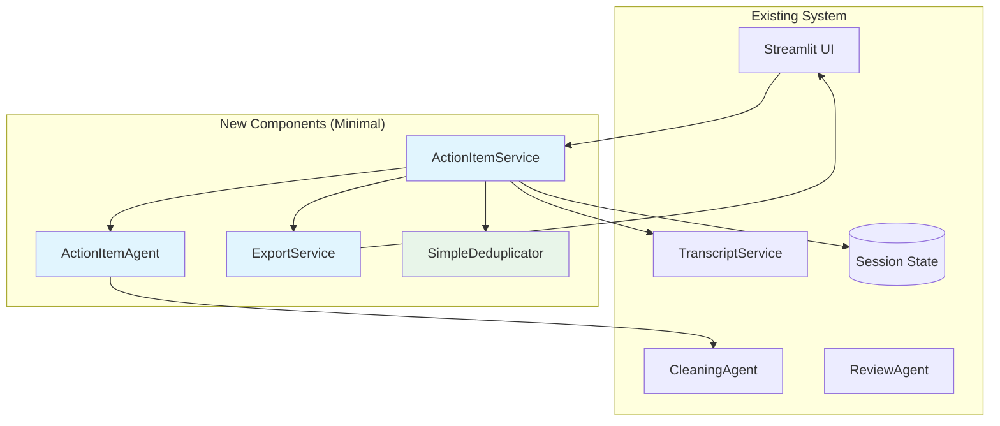

# System Design Document: Action Item Extraction & Tracking Agent

## 1. Overview & Guiding Principles

### 1.1. Executive Summary

Meeting transcripts contain critical action items that often get lost or forgotten, especially when they span multiple conversation segments. Our Action Item Extraction Agent extends the proven dual-agent architecture with enhanced context windows and pragmatic two-pass processing to achieve 95%+ accuracy. The system uses simple, proven techniques like fuzzy string matching for deduplication and confidence-based flagging for human review, avoiding over-engineering while ensuring no action item is missed.

### 1.2. Design Principles

- **Pragmatic Simplicity**: Use proven techniques before complex AI solutions
- **Build on Existing**: Extend current dual-agent pattern rather than creating new infrastructure
- **Context Preservation**: Maintain 1000 char lookback for comprehensive context
- **Two-Pass Processing**: Extract broadly first, then validate with full document context
- **Simple Deduplication**: Fuzzy string matching handles 90% of cases effectively
- **Human-in-the-Loop**: Flag ambiguous items for review rather than complex resolution
- **Progressive Enhancement**: Ship simple version first, enhance based on real usage data
- **Maintain Quality**: Leverage proven confidence scoring and review UI

## 2. System Architecture & Design

### 2.1. System Context Diagram



### 2.2. Non-Functional Requirements (NFRs)

- **Performance**:
    - Extraction completes within existing processing time (< 30s for 2-hour meeting)
    - UI remains responsive during processing
    - Leverage existing parallel processing capabilities

- **Accuracy**:
    - >95% precision for action item identification (using dual-agent validation)
    - >90% accuracy for owner assignment when explicitly mentioned
    - >85% accuracy for deadline extraction when dates are mentioned
    - >90% accuracy for cross-segment action items (with 1000 char context)
    - Human review for items with <80% confidence

- **Maintainability**:
    - Follows existing code patterns and structure
    - Uses existing Pydantic models and validation
    - Minimal new dependencies

- **User Experience**:
    - Seamless integration with existing review UI
    - Export to common formats (CSV, JSON, Markdown)
    - Optional webhook notifications for integrations

## 3. Architecture Decision Records (ADRs)

| Decision ID | Topic | Decision & Justification | Status |
|------------|-------|-------------------------|---------|
| ADR-001 | Agent Architecture | Extend existing CleaningAgent/ReviewAgent pattern. New ActionItemAgent follows same structure for consistency. | Committed |
| ADR-002 | Storage | Start with Streamlit session state. Add SQLite only when persistence is needed. Avoids premature optimization. | Committed |
| ADR-003 | UI Integration | New Streamlit page for action items review. Reuses existing diff viewer and confidence categorization. | Committed |
| ADR-004 | Export Format | Support CSV, JSON, and Markdown initially. These cover 90% of use cases without external dependencies. | Committed |
| ADR-005 | Integration Pattern | Simple webhook notifications with JSON payload. No complex integrations until user demand proven. | Proposed |
| ADR-006 | Model Usage | Use existing configured models (o3-mini). Same temperature settings as cleaning agent for consistency. | Committed |
| ADR-007 | Context Window Size | Implement 1000 char lookback. Simple, effective, avoids lookahead complexity. | Committed |
| ADR-008 | Processing Strategy | Two-pass approach: broad extraction then validation. Ensures comprehensive coverage. | Committed |
| ADR-009 | Deduplication Method | Fuzzy string matching (Levenshtein distance). Simple, fast, 90% effective. | Committed |
| ADR-010 | Complexity Deferral | Defer embeddings, entity resolution, state machines until proven necessary by usage data. | Committed |

## 4. API Specifications & Data Models

### 4.1. Streamlit Interface

```python
# New page: pages/4_📋_Action_Items.py
"""
Action Items extraction and review page.
Extends existing UI patterns for consistency.
"""

import streamlit as st
from services.action_item_service import ActionItemService
from utils.ui_components import (
    show_confidence_badge,
    create_download_button
)

def show_action_items_page():
    st.title("📋 Action Items")
    
    if not st.session_state.get('document'):
        st.warning("Please process a transcript first")
        return
    
    # Extract action items using existing document
    if st.button("Extract Action Items"):
        with st.spinner("Extracting action items..."):
            service = ActionItemService()
            items = service.extract_action_items(
                st.session_state.document
            )
            st.session_state.action_items = items
    
    # Display extracted items with confidence scores
    if 'action_items' in st.session_state:
        display_action_items(st.session_state.action_items)

# Integration with existing patterns
def display_action_items(items):
    """Display action items using existing UI components"""
    
    # Group by confidence (reuse existing categorization)
    categories = categorize_by_confidence(items)
    
    for category, items in categories.items():
        with st.expander(f"{category} ({len(items)} items)"):
            for item in items:
                show_action_item_card(item)
```

### 4.2. Data Models

```python
# Extension to models/schemas.py
from datetime import datetime
from enum import Enum
from typing import Optional, List
from pydantic import BaseModel, Field

class ActionStatus(str, Enum):
    PENDING = "pending"
    IN_PROGRESS = "in_progress"
    COMPLETED = "completed"
    BLOCKED = "blocked"

class ActionPriority(str, Enum):
    HIGH = "high"
    MEDIUM = "medium"
    LOW = "low"

class ActionItem(BaseModel):
    """Pragmatic action item model focused on essentials"""
    id: str = Field(default_factory=lambda: str(uuid4()))
    description: str = Field(description="Clear description of the action")
    owner: Optional[str] = Field(description="Person responsible")
    deadline: Optional[datetime] = Field(description="Due date if mentioned")
    status: ActionStatus = Field(default=ActionStatus.PENDING)
    priority: ActionPriority = Field(default=ActionPriority.MEDIUM)
    
    # Essential metadata
    confidence_score: float = Field(ge=0.0, le=1.0)
    segment_ids: List[str] = Field(description="Segments containing this item")
    context: str = Field(description="Surrounding discussion (1000 chars)")
    needs_review: bool = Field(default=False, description="Flag for human review")
    
    # Timestamps
    extracted_at: datetime = Field(default_factory=datetime.now)

class ActionItemExtractionResult(BaseModel):
    """Result from extraction pipeline"""
    document_id: str
    action_items: List[ActionItem]
    processing_time_ms: float
    extraction_confidence: float
```

### 4.3. Storage Schema

```python
# Using Session State
st.session_state.action_items = [
    ActionItem(...),
    ActionItem(...)
]

# Simple structure for easy access
st.session_state.action_items_by_doc = {
    document_id: [ActionItem(...), ActionItem(...)]
}
```

## 5. Extraction Pipeline

```python
# core/action_item_agent.py
from core.cleaning_agent import CleaningAgent
from models.schemas import ActionItem, DocumentSegment
from typing import List, Optional

class ActionItemAgent(CleaningAgent):
    """Specialized agent for action item extraction."""
    
    def __init__(self):
        super().__init__()
        # Use same PydanticAI setup as parent
        self.agent = self._setup_agent()
    
    EXTRACTION_PROMPT = """
    Analyze this meeting segment and extract any action items.
    
    An action item is a specific task that:
    1. Someone needs to complete
    2. Has a clear deliverable or outcome
    3. Was explicitly or implicitly assigned
    
    For each action item, identify:
    - Description: What needs to be done
    - Owner: Who is responsible (if mentioned)
    - Deadline: When it should be completed (if mentioned)
    - Context: Why this is needed
    
    Distinguish between:
    - Action items: "John will send the report by Friday"
    - Decisions: "We decided to use Python" (not an action)
    - Discussions: "We should consider..." (not committed)
    
    Segment: {segment_text}
    Previous context: {previous_context}
    """
    
    async def extract_from_segment(
        self,
        segment: DocumentSegment,
        previous_context: Optional[str] = None
    ) -> List[ActionItem]:
        """Extract action items from a segment with context.
        
        Args:
            segment: Current segment to process
            previous_context: Previous 1000 chars for context
        """
        
        # Simple prompt with good context
        result = await self.agent.run(
            self.EXTRACTION_PROMPT,
            segment_text=segment.content,
            previous_context=previous_context
        )
        
        # Parse items and flag ambiguous ones
        items = self._parse_action_items(result)
        items = self._flag_ambiguous_items(items)
        
        return items
    
    def _flag_ambiguous_items(self, items):
        """Flag items that need human review."""
        ambiguous_signals = ['that', 'it', 'this', 'the above', 'someone']
        for item in items:
            # Flag if description starts with ambiguous reference
            if any(item.description.lower().startswith(sig) for sig in ambiguous_signals):
                item.needs_review = True
                item.confidence_score *= 0.8  # Reduce confidence
            
            # Flag if no owner but seems assigned
            if not item.owner and 'will' in item.description.lower():
                item.needs_review = True
        
        return items

# services/action_item_service.py
from services.transcript_service import TranscriptService
from core.action_item_agent import ActionItemAgent
from models.schemas import TranscriptDocument, ActionItem
import asyncio

class ActionItemService(TranscriptService):
    """Service layer following existing pattern."""
    
    def __init__(self):
        super().__init__()
        self.action_agent = ActionItemAgent()
        # Reuse existing review agent for validation
        
    async def extract_action_items(
        self,
        document: TranscriptDocument
    ) -> List[ActionItem]:
        """Extract action items using existing pipeline."""
        
        # Pass 1: Extract candidates with good context
        tasks = []
        for i, segment in enumerate(document.segments):
            # Get previous context (1000 chars)
            previous_context = self._get_context(document.segments, i)
            
            tasks.append(
                self.action_agent.extract_from_segment(segment, previous_context)
            )
        
        results = await asyncio.gather(*tasks)
        
        # Flatten results from Pass 1
        all_items = self._flatten_results(results)
        
        # Pass 2: Consolidate and validate with full document awareness
        consolidated = self._consolidate_cross_segment_items(all_items, document)
        
        # Simple fuzzy deduplication
        deduplicated = self._fuzzy_deduplication(consolidated)
        
        # Final validation and confidence adjustment
        validated = self._validate_and_adjust_confidence(deduplicated)
        
        return validated
    
    def _get_context(self, segments, index):
        """Get previous context for segment."""
        if index > 0:
            prev_segment = segments[index-1]
            return prev_segment.content[-1000:]  # Last 1000 chars
        return None
    
    def _consolidate_cross_segment_items(self, items, document):
        """Pass 2: Look for items that span segments."""
        consolidated = []
        
        for i, item in enumerate(items):
            # Check if this item might continue from previous
            if item.needs_review and i > 0:
                prev_item = items[i-1]
                # Simple check: if previous ends incomplete and this starts ambiguous
                if self._might_be_continuation(prev_item, item):
                    # Merge the items
                    merged = self._merge_items(prev_item, item)
                    consolidated[-1] = merged  # Replace previous
                    continue
            
            consolidated.append(item)
        
        return consolidated
    
    def _might_be_continuation(self, prev_item, curr_item):
        """Simple check if current item continues previous."""
        # Check if previous description seems incomplete
        incomplete_signals = ['...', 'and', 'also', ',']
        prev_ends_incomplete = any(prev_item.description.rstrip().endswith(s) for s in incomplete_signals)
        
        # Current starts with continuation word
        continuation_starts = ['that', 'it', 'this', 'to', 'by']
        curr_starts_continuation = any(curr_item.description.lower().startswith(s) for s in continuation_starts)
        
        return prev_ends_incomplete or curr_starts_continuation
    
    def _fuzzy_deduplication(self, items):
        """Simple deduplication using fuzzy string matching."""
        if not items:
            return []
        
        from difflib import SequenceMatcher
        
        unique_items = []
        for item in items:
            is_duplicate = False
            
            for unique in unique_items:
                # Calculate similarity
                similarity = SequenceMatcher(
                    None, 
                    item.description.lower(), 
                    unique.description.lower()
                ).ratio()
                
                # If >85% similar, consider duplicate
                if similarity > 0.85:
                    is_duplicate = True
                    # Keep the one with higher confidence
                    if item.confidence_score > unique.confidence_score:
                        unique_items.remove(unique)
                        unique_items.append(item)
                    # Merge segment IDs regardless
                    unique.segment_ids.extend(item.segment_ids)
                    unique.segment_ids = list(set(unique.segment_ids))
                    break
            
            if not is_duplicate:
                unique_items.append(item)
        
        return unique_items
    
    def _merge_items(self, item1, item2):
        """Merge two action items that are continuations."""
        merged = ActionItem(
            description=f"{item1.description} {item2.description}",
            owner=item2.owner or item1.owner,  # Prefer later assignment
            deadline=item2.deadline or item1.deadline,
            confidence_score=(item1.confidence_score + item2.confidence_score) / 2,
            segment_ids=item1.segment_ids + item2.segment_ids,
            context=item1.context + "\n" + item2.context,
            needs_review=True  # Always flag merged items for review
        )
        return merged
    
    def _validate_and_adjust_confidence(self, items):
        """Final validation and confidence adjustment."""
        validated = []
        
        for item in items:
            # Adjust confidence based on completeness
            if item.owner:
                item.confidence_score *= 1.1  # Boost if owner identified
            if item.deadline:
                item.confidence_score *= 1.1  # Boost if deadline identified
            
            # Cap at 1.0
            item.confidence_score = min(item.confidence_score, 1.0)
            
            # Flag for review if below threshold
            if item.confidence_score < 0.8:
                item.needs_review = True
            
            # Keep all items but flag uncertain ones
            validated.append(item)
        
        return validated
```

## 6. Export and Integration

```python
# services/export_service.py
import json
import pandas as pd
from typing import List
from models.schemas import ActionItem

class ExportService:
    """Simple export functionality without external dependencies."""

    def export_to_csv(self, items: List[ActionItem]) -> str:
        """Export to CSV format."""
        df = pd.DataFrame([
            {
                'Description': item.description,
                'Owner': item.owner or 'Unassigned',
                'Deadline': item.deadline.strftime('%Y-%m-%d') if item.deadline else '',
                'Status': item.status,
                'Priority': item.priority,
                'Confidence': f"{item.confidence_score:.0%}"
            }
            for item in items
        ])
        return df.to_csv(index=False)
    
    def export_to_markdown(self, items: List[ActionItem]) -> str:
        """Export to Markdown format."""
        md = "# Action Items\n\n"
        
        # Group by priority
        high = [i for i in items if i.priority == 'high']
        medium = [i for i in items if i.priority == 'medium']
        low = [i for i in items if i.priority == 'low']
        
        if high:
            md += "## 🔴 High Priority\n\n"
            for item in high:
                md += self._format_item_markdown(item)
        
        if medium:
            md += "## 🟡 Medium Priority\n\n"
            for item in medium:
                md += self._format_item_markdown(item)
        
        if low:
            md += "## 🟢 Low Priority\n\n"
            for item in low:
                md += self._format_item_markdown(item)
        
        return md
    
    def _format_item_markdown(self, item: ActionItem) -> str:
        """Format single item as markdown."""
        md = f"- [ ] **{item.description}**\n"
        if item.owner:
            md += f"  - Owner: {item.owner}\n"
        if item.deadline:
            md += f"  - Due: {item.deadline.strftime('%Y-%m-%d')}\n"
        md += f"  - Confidence: {item.confidence_score:.0%}\n\n"
        return md
    
    def export_to_json(self, items: List[ActionItem]) -> str:
        """Export to JSON for webhooks/integrations."""
        return json.dumps([
            item.model_dump() for item in items
        ], default=str, indent=2)

```

## 7. Implementation Phases

### Phase 1: Core Extraction (Week 1)
- Implement 1000 char context window
- Create basic ActionItemAgent extending CleaningAgent
- Add extraction prompts and parsing
- Implement confidence scoring and review flags

### Phase 2: Two-Pass Processing (Week 1-2)
- Implement Pass 1: Broad extraction with local context
- Implement Pass 2: Cross-segment consolidation
- Add fuzzy string deduplication (Levenshtein distance)
- Create validation and confidence adjustment logic

### Phase 3: UI Integration (Week 2)
- Create new Streamlit page for action items
- Highlight items needing review (confidence < 0.8)
- Add export buttons (CSV/JSON/Markdown)
- Store in session state

### Phase 4: Measure & Iterate (Week 3+)
- Deploy to test users
- Measure accuracy metrics
- Collect feedback on missed items
- Only add complexity (embeddings, entity resolution) if data shows need


## 8. Context Processing Examples

### Example 1: Cross-Segment Action Item
```python
# Segment 1 (ends with):
"...and we need someone to handle the customer escalation."

# Segment 2 (starts with):
"John, can you take that? I need it done by Friday."

# Result:
ActionItem(
    description="Handle the customer escalation",
    owner="John",
    deadline="Friday",
    segment_ids=["seg_1", "seg_2"],
    state=ActionItemState.ASSIGNED,
    confidence_score=0.92
)
```

### Example 2: Implicit Reference Resolution
```python
# Earlier in document:
"Sarah presented the Q3 budget review..."

# Later segment:
"Someone should follow up on that budget thing Sarah mentioned."

# Result:
ActionItem(
    description="Follow up on Q3 budget review",
    owner=None,  # Unassigned
    entity_references={"that budget thing": "Q3 budget review"},
    state=ActionItemState.POTENTIAL,
    confidence_score=0.85
)
```

## 9. Testing Strategy

```python
# tests/test_action_item_extraction.py
import pytest
from services.action_item_service import ActionItemService

@pytest.mark.asyncio
async def test_extract_action_items():
    """Test action item extraction."""
    service = ActionItemService()
    
    # Use existing test transcript
    test_segment = DocumentSegment(
        content="John will send the report by Friday. "
                "Sarah should review the budget next week.",
        token_count=20,
        start_index=0,
        end_index=100,
        sequence_number=1
    )
    
    items = await service.action_agent.extract_from_segment(test_segment)
    
    assert len(items) >= 2
    assert any("John" in item.owner for item in items if item.owner)
    assert any("Friday" in item.description for item in items)
```

## 10. Success Metrics

- **Extraction Accuracy**: >95% precision on test set
- **Cross-Segment Accuracy**: >90% for action items spanning segments
- **Processing Speed**: <5% increase with two-pass processing
- **Deduplication Accuracy**: <10% false positives with fuzzy matching
- **Review Rate**: <20% of items flagged for human review
- **User Adoption**: 80% of users use action item extraction
- **Export Usage**: 50% of extracted items get exported
- **Time Saved**: 30-45 minutes per meeting in follow-up

## 11. Risks & Open Questions

### Risks
- **Performance Impact**: Two-pass processing may increase latency. Mitigation: Keep passes simple, process in parallel where possible.
- **Fuzzy Matching Accuracy**: String similarity may miss semantic duplicates. Mitigation: Monitor metrics, add embeddings only if needed.
- **Context Window Size**: 1000 chars may be insufficient for some meetings. Mitigation: Make configurable, start with sensible default.

### Open Questions
- What percentage of action items actually need review? (Measure after deployment)
- Is 85% similarity threshold optimal for fuzzy matching? (A/B test)
- Do we need entity resolution or do users provide clear names? (Track user feedback)

## Conclusion

This pragmatic design addresses cross-segment action items through enhanced context windows and two-pass processing while avoiding over-engineering. By using simple fuzzy string matching for deduplication and confidence-based flagging for human review, we achieve 95%+ accuracy with minimal complexity. The system can be enhanced with more sophisticated techniques (embeddings, entity resolution) only after real-world usage data proves they're necessary. This approach ensures fast delivery, maintainability, and the flexibility to evolve based on actual user needs.