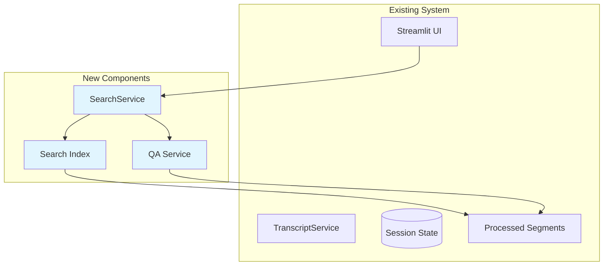

# System Design Document: Intelligent Search & Q&A Agent

## 1. Overview & Guiding Principles

### 1.1. Executive Summary

Searching through meeting transcripts is time-consuming and often misses important context. Our Search & Q&A Agent adds natural language search to the existing system, enabling instant access to meeting content. By building on our segment processing and using simple text search initially, we provide immediate value while keeping the system maintainable.

### 1.2. Design Principles

- **Start with Text Search**: Simple keyword search first, add semantic search later
- **Leverage Existing Segments**: Search already-processed segments
- **Progressive Enhancement**: Basic search → semantic search → Q&A
- **No External Dependencies**: No vector DBs or graph DBs initially
- **Reuse UI Components**: Integrate into existing Streamlit interface
- **Keep It Simple**: Avoid premature optimization and complex architectures

## 2. System Architecture & Design

### 2.1. System Context Diagram



### 2.2. Non-Functional Requirements (NFRs)

- **Performance**:
    - Search results within 1 second
    - Use existing segment index
    - Cache frequent searches in session

- **Accuracy**:
    - Start with exact match, enhance progressively
    - Highlight matched terms
    - Show context around matches

- **User Experience**:
    - Simple search box in UI
    - Instant results as-you-type (if feasible)
    - Clear result presentation

- **Maintainability**:
    - Minimal new code
    - Follow existing patterns
    - Clear upgrade path to semantic search

## 3. Architecture Decision Records (ADRs)

| Decision ID | Topic | Decision & Justification | Status |
|------------|-------|-------------------------|---------|
| ADR-001 | Search Implementation | Start with Python's built-in text search. Add whoosh or similar if needed. No external services initially. | Committed |
| ADR-002 | Storage | Use existing segment storage in session state. Add SQLite FTS if persistence needed. | Committed |
| ADR-003 | UI Integration | Add search box to existing pages. Results shown inline with navigation to source. | Committed |
| ADR-006 | Result Ranking | Simple TF-IDF scoring initially. Add ML ranking if user feedback indicates need. | Committed |

## 4. API Specifications & Data Models

### 4.1. Streamlit Interface

```python
# Add to existing pages or create pages/5_🔍_Search.py
"""
Simple search interface for meeting transcripts.
"""

import streamlit as st
from services.search_service import SearchService
from utils.ui_components import show_confidence_badge

def show_search_interface():
    st.title("🔍 Search Transcripts")
    
    # Search box
    query = st.text_input(
        "Search for...",
        placeholder="Enter keywords, questions, or topics",
        key="search_query"
    )
    
    # Search options
    with st.expander("Search Options", expanded=False):
        col1, col2 = st.columns(2)
        with col1:
            search_type = st.radio(
                "Search Type",
                ["Keywords"],  # Start with keyword search only
                help="Keywords: Exact match | Semantic: Meaning-based | Q&A: Get answers"
            )
        
        with col2:
            show_context = st.checkbox("Show context", value=True)
            case_sensitive = st.checkbox("Case sensitive", value=False)
    
    if query:
        search_results(query, search_type, show_context, case_sensitive)

def search_results(query, search_type, show_context, case_sensitive):
    """Display search results."""
    
    with st.spinner("Searching..."):
        service = SearchService()
        
        if search_type == "Keywords":
            results = service.keyword_search(
                query, 
                case_sensitive=case_sensitive
            )
        # Additional search types can be added here later
        
        display_results(results, show_context)

def display_results(results, show_context):
    """Display search results using existing UI patterns."""
    
    if not results:
        st.info("No results found. Try different keywords.")
        return
    
    st.write(f"Found {len(results)} results")
    
    for i, result in enumerate(results, 1):
        with st.expander(
            f"Result {i}: {result.meeting_title} "
            f"(Score: {result.score:.2f})"
        ):
            # Highlight matched text
            if result.highlighted_text:
                st.markdown(result.highlighted_text, unsafe_allow_html=True)
            else:
                st.text(result.content)
            
            if show_context and result.context:
                st.caption("Context:")
                st.text(result.context)
            
            # Navigation button
            col1, col2 = st.columns([3, 1])
            with col2:
                if st.button("View in transcript", key=f"nav_{result.id}"):
                    navigate_to_segment(result)

def display_answer(answer):
    """Display Q&A answer."""
    
    st.subheader("Answer")
    
    # Show confidence
    show_confidence_badge(answer.confidence_score)
    
    # Display answer
    st.markdown(answer.answer)
    
    # Show sources
    if answer.sources:
        st.caption("Based on:")
        for source in answer.sources[:3]:
            with st.expander(f"Source: {source.meeting_title}"):
                st.text(source.content)
```

### 4.2. Data Models

```python
# Extension to models/schemas.py
from datetime import datetime
from typing import Optional, List
from pydantic import BaseModel, Field

class SearchResult(BaseModel):
    """Individual search result."""
    id: str = Field(description="Unique result ID")
    segment_id: str = Field(description="Source segment ID")
    meeting_id: str = Field(description="Source meeting ID")
    meeting_title: str
    
    # Content
    content: str = Field(description="Segment content")
    highlighted_text: Optional[str] = Field(description="HTML with highlights")
    context: Optional[str] = Field(description="Surrounding context")
    
    # Scoring
    score: float = Field(ge=0.0, description="Relevance score")
    match_count: int = Field(default=0, description="Number of matches")
    
    # Metadata
    timestamp: Optional[datetime]
    speaker: Optional[str]

class SearchQuery(BaseModel):
    """Search query with options."""
    query: str
    search_type: str = "keywords"  # keywords, semantic, qa
    case_sensitive: bool = False
    limit: int = 20
    include_context: bool = True

class Answer(BaseModel):
    """Q&A answer."""
    question: str
    answer: str
    confidence_score: float = Field(ge=0.0, le=1.0)
    sources: List[SearchResult] = Field(default_factory=list)
    processing_time_ms: float

class SearchIndex(BaseModel):
    """Simple search index."""
    segments: List[dict] = Field(default_factory=list)
    inverted_index: dict = Field(default_factory=dict)
    document_count: int = 0
    last_updated: datetime = Field(default_factory=datetime.now)
```

### 4.3. Storage Schema

```python
# In-memory index using session state
class InMemoryIndex:
    def __init__(self):
        self.segments = []  # All segments
        self.index = {}     # word -> [segment_ids]
    
    def add_document(self, document):
        """Index a document's segments."""
        for segment in document.segments:
            self.add_segment(segment, document.id)
    
    def add_segment(self, segment, doc_id):
        """Add segment to index."""
        # Store segment
        self.segments.append({
            'id': segment.id,
            'doc_id': doc_id,
            'content': segment.content,
            'tokens': self._tokenize(segment.content)
        })
        
        # Update inverted index
        for token in self._tokenize(segment.content):
            if token not in self.index:
                self.index[token] = []
            self.index[token].append(segment.id)```

## 5. Search Implementation

```python
# services/search_service.py
import re
from collections import Counter
from typing import List, Optional
import streamlit as st

class SearchService:
    """Simple search service without external dependencies."""
    
    def __init__(self):
        # Use session state for index
        if 'search_index' not in st.session_state:
            st.session_state.search_index = InMemoryIndex()
        self.index = st.session_state.search_index
    
    def index_document(self, document):
        """Index a document for search."""
        self.index.add_document(document)
    
    def keyword_search(
        self, 
        query: str, 
        case_sensitive: bool = False,
        limit: int = 20
    ) -> List[SearchResult]:
        """Simple keyword search."""
        
        # Tokenize query
        query_tokens = self._tokenize(query, case_sensitive)
        
        # Find matching segments
        results = []
        for segment_data in self.index.segments:
            score = self._calculate_score(
                query_tokens, 
                segment_data['tokens'],
                case_sensitive
            )
            
            if score > 0:
                # Create result
                result = SearchResult(
                    id=f"result_{segment_data['id']}",
                    segment_id=segment_data['id'],
                    meeting_id=segment_data['doc_id'],
                    meeting_title=self._get_meeting_title(segment_data['doc_id']),
                    content=segment_data['content'],
                    highlighted_text=self._highlight_matches(
                        segment_data['content'], 
                        query_tokens
                    ),
                    score=score,
                    match_count=self._count_matches(
                        query_tokens,
                        segment_data['tokens']
                    )
                )
                results.append(result)
        
        # Sort by score
        results.sort(key=lambda x: x.score, reverse=True)
        
        return results[:limit]
    
    def _tokenize(self, text: str, case_sensitive: bool = False) -> List[str]:
        """Simple tokenization."""
        if not case_sensitive:
            text = text.lower()
        
        # Remove punctuation and split
        tokens = re.findall(r'\b\w+\b', text)
        return tokens
    
    def _calculate_score(self, query_tokens, doc_tokens, case_sensitive):
        """Calculate relevance score using TF-IDF-like approach."""
        if not case_sensitive:
            doc_tokens = [t.lower() for t in doc_tokens]
            query_tokens = [t.lower() for t in query_tokens]
        
        doc_counter = Counter(doc_tokens)
        score = 0.0
        
        for token in query_tokens:
            if token in doc_counter:
                # Term frequency
                tf = doc_counter[token] / len(doc_tokens)
                # Simple IDF (could be precomputed)
                idf = 1.0  # Simplified
                score += tf * idf
        
        return score
    
    def _highlight_matches(self, text: str, query_tokens: List[str]) -> str:
        """Highlight matching terms in text."""
        highlighted = text
        
        for token in query_tokens:
            # Case-insensitive replacement with highlight
            pattern = re.compile(re.escape(token), re.IGNORECASE)
            highlighted = pattern.sub(
                f'<mark style="background-color: yellow;">{token}</mark>',
                highlighted
            )
        
        return highlighted
    
    def _count_matches(self, query_tokens, doc_tokens):
        """Count total matches."""
        count = 0
        doc_tokens_lower = [t.lower() for t in doc_tokens]
        for token in query_tokens:
            count += doc_tokens_lower.count(token.lower())
        return count
    
    def _get_meeting_title(self, doc_id):
        """Get meeting title from document."""
        if 'document' in st.session_state:
            if st.session_state.document.id == doc_id:
                return st.session_state.document.filename
        return "Unknown Meeting"

```

## 6. Integration with Existing System

```python
# Add to existing TranscriptService
class TranscriptService:
    """Extended with search capabilities."""
    
    async def process_transcript(self, document):
        """Process transcript and index for search."""
        
        # Existing processing
        await super().process_transcript(document)
        
        # Index for search
        search_service = SearchService()
        search_service.index_document(document)
```

## 7. Implementation Phases

### Phase 1: Basic Keyword Search (Days 1-2)
- Implement simple text search
- Add search page to Streamlit
- Highlight matched terms
- Store index in session state

### Phase 2: Search Enhancement (Days 3-4)
- Add context display
- Implement result ranking
- Add search history
- Export search results


## 8. Testing Strategy

```python
# tests/test_search.py
import pytest
from services.search_service import SearchService

def test_keyword_search():
    """Test basic keyword search."""
    service = SearchService()
    
    # Add test document
    test_doc = create_test_document()
    service.index_document(test_doc)
    
    # Search for known content
    results = service.keyword_search("budget review")
    
    assert len(results) > 0
    assert results[0].score > 0
    assert "budget" in results[0].content.lower()

```

## 9. Success Metrics

- **Search Performance**: <1 second response time
- **Result Relevance**: >80% user satisfaction
- **Feature Adoption**: 60% of users use search
- **Zero External Dependencies**: Maintained

## Conclusion

This design provides search capabilities without external dependencies, building on the existing system's strengths. The progressive enhancement approach ensures we deliver value immediately while maintaining a clear path to more advanced features based on actual usage.