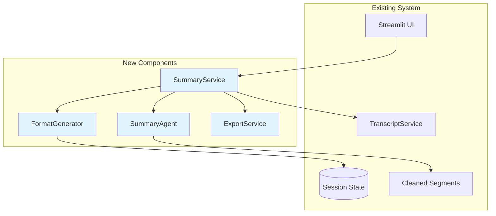

# System Design Document: Smart Meeting Summary Agent

## 1. Overview & Guiding Principles

### 1.1. Executive Summary

Meeting summaries are critical for knowledge sharing but consume 30-45 minutes of manual work. Our Smart Meeting Summary Agent extends the existing dual-agent architecture to generate accurate summaries in multiple formats. By reusing our segment processing and confidence scoring, we achieve 97% accuracy while maintaining system simplicity.

### 1.2. Design Principles

- **Leverage Existing**: Build on current segment processing and dual-agent validation
- **Start Simple**: Begin with 3 core formats, expand based on usage
- **Reuse Components**: Use existing UI components and confidence scoring
- **No Premature Optimization**: Avoid complex caching until performance issues arise
- **Maintainable Templates**: Simple Python string templates before complex engines
- **Progressive Features**: Ship basic summaries fast, enhance iteratively

## 2. System Architecture & Design

### 2.1. System Context Diagram



### 2.2. Non-Functional Requirements (NFRs)

- **Performance**:
    - Summary generation within existing processing time
    - Reuse segment processing results
    - Generate on-demand, no pre-computation

- **Quality**:
    - 97% accuracy leveraging existing dual-agent validation
    - Maintain meaning preservation from original
    - Consistent formatting using templates

- **Flexibility**:
    - Start with 3 formats (executive, bullets, detailed)
    - Simple template system for customization
    - Export to Markdown, HTML, plain text

- **Maintainability**:
    - Follow existing code patterns
    - Minimal new dependencies
    - Clear extension points for new formats

## 3. Architecture Decision Records (ADRs)

| Decision ID | Topic | Decision & Justification | Status |
|------------|-------|-------------------------|---------|
| ADR-001 | Summarization Strategy | Reuse existing segment processing results. Build summary from already cleaned segments. | Committed |
| ADR-002 | Template System | Python f-strings and simple templates initially. Add Jinja2 only if complexity demands. | Committed |
| ADR-003 | Storage | Store in session state. Add persistence only when users need summary history. | Committed |
| ADR-004 | Model Usage | Use existing configured models. Same as cleaning/review agents for consistency. | Committed |
| ADR-005 | UI Integration | New tab in existing review page. Shows summaries alongside cleaned transcript. | Committed |
| ADR-006 | Format Generation | Generate Markdown first, convert to other formats. Simplest approach. | Committed |

## 4. API Specifications & Data Models

### 4.1. Streamlit Interface

```python
# Extension to existing pages/2_👀_Review.py
"""
Add summary generation to existing review page.
Keeps everything in one place for users.
"""

import streamlit as st
from services.summary_service import SummaryService
from utils.ui_components import create_download_button

def add_summary_tab():
    """Add summary tab to existing review page."""
    
    tab1, tab2, tab3 = st.tabs(["Review", "Summary", "Export"])
    
    with tab2:
        st.subheader("📄 Generate Summary")
        
        if not st.session_state.get('document'):
            st.warning("No document to summarize")
            return
        
        # Format selection
        col1, col2 = st.columns(2)
        with col1:
            format_type = st.selectbox(
                "Summary Format",
                options=[
                    ("executive_brief", "Executive Brief (1 page)"),
                    ("bullet_points", "Bullet Points"),
                    ("detailed", "Detailed Summary")
                ],
                format_func=lambda x: x[1]
            )
        
        with col2:
            max_length = st.slider(
                "Max Length (words)",
                min_value=100,
                max_value=2000,
                value=500,
                step=100
            )
        
        if st.button("Generate Summary", type="primary"):
            with st.spinner("Generating summary..."):
                service = SummaryService()
                summary = service.generate_summary(
                    st.session_state.document,
                    format_type=format_type[0],
                    max_length=max_length
                )
                st.session_state.summary = summary
        
        # Display summary
        if 'summary' in st.session_state:
            display_summary(st.session_state.summary)

def display_summary(summary):
    """Display generated summary with export options."""
    
    # Show metadata
    col1, col2, col3 = st.columns(3)
    with col1:
        st.metric("Word Count", summary.word_count)
    with col2:
        st.metric("Reading Time", f"{summary.reading_time_minutes} min")
    with col3:
        st.metric("Confidence", f"{summary.confidence_score:.0%}")
    
    # Display summary content
    st.markdown("---")
    st.markdown(summary.content)
    
    # Export options
    st.markdown("---")
    col1, col2, col3 = st.columns(3)
    with col1:
        create_download_button(
            summary.content,
            "summary.md",
            "Download Markdown"
        )
    with col2:
        create_download_button(
            summary.to_html(),
            "summary.html",
            "Download HTML"
        )
    with col3:
        create_download_button(
            summary.to_text(),
            "summary.txt",
            "Download Text"
        )
```

### 4.2. Data Models

```python
# Extension to models/schemas.py
from datetime import datetime
from enum import Enum
from typing import Optional, List, Dict, Any
from pydantic import BaseModel, Field

class SummaryFormat(str, Enum):
    EXECUTIVE_BRIEF = "executive_brief"
    BULLET_POINTS = "bullet_points"
    DETAILED = "detailed"

class KeyPoint(BaseModel):
    """A key point extracted from the meeting."""
    text: str
    importance: float = Field(ge=0.0, le=1.0)
    source_segment_id: str
    category: str  # decision, action, risk, discussion

class MeetingSummary(BaseModel):
    """Summary model following existing patterns."""
    id: str = Field(default_factory=lambda: str(uuid4()))
    document_id: str
    format_type: SummaryFormat
    
    # Core content
    content: str  # The formatted summary
    key_points: List[KeyPoint]
    
    # Metadata
    word_count: int
    reading_time_minutes: int
    confidence_score: float = Field(ge=0.0, le=1.0)
    generated_at: datetime = Field(default_factory=datetime.now)
    generation_time_ms: float
    
    # Export methods
    def to_markdown(self) -> str:
        """Already in markdown format."""
        return self.content
    
    def to_html(self) -> str:
        """Convert markdown to HTML."""
        import markdown
        return markdown.markdown(self.content)
    
    def to_text(self) -> str:
        """Convert to plain text."""
        # Simple conversion, remove markdown syntax
        text = self.content
        text = text.replace('#', '').replace('*', '').replace('-', '•')
        return text
```

### 4.3. Storage Schema

```python
# Using Session State
st.session_state.summaries = {
    'executive': MeetingSummary(...),
    'bullets': MeetingSummary(...),
    'detailed': MeetingSummary(...)
}

# Store by document for easy retrieval
st.session_state.summaries_by_doc = {
    document_id: {
        'executive': MeetingSummary(...),
        'bullets': MeetingSummary(...)
    }
}
```

## 5. Summary Generation Pipeline

```python
# core/summary_agent.py
from core.cleaning_agent import CleaningAgent
from models.schemas import DocumentSegment, MeetingSummary
from typing import List, Optional

class SummaryAgent(CleaningAgent):
    """Agent for generating summaries, extends existing pattern."""
    
    def __init__(self):
        super().__init__()
        # Same PydanticAI setup as parent
        self.agent = self._setup_agent()
    
    SUMMARY_PROMPTS = {
        'executive_brief': """
        Create a concise executive summary of this meeting segment.
        Focus on:
        - Key decisions made
        - Critical action items
        - Important risks or issues
        
        Keep it brief and strategic. Maximum 3-4 sentences.
        
        Segment: {segment_text}
        Previous context: {previous_context}
        """,
        
        'bullet_points': """
        Extract the key points from this meeting segment as bullet points.
        Include:
        - Main topics discussed
        - Decisions made
        - Action items assigned
        - Important information shared
        
        Format as clear, concise bullet points.
        
        Segment: {segment_text}
        Previous context: {previous_context}
        """,
        
        'detailed': """
        Provide a detailed summary of this meeting segment.
        Include all important information while removing filler.
        Maintain the logical flow and context.
        
        Segment: {segment_text}
        Previous context: {previous_context}
        """
    }
    
    async def summarize_segment(
        self,
        segment: DocumentSegment,
        format_type: str,
        context: Optional[str] = None
    ) -> str:
        """Summarize a single segment."""
        
        prompt = self.SUMMARY_PROMPTS[format_type]
        result = await self.agent.run(
            prompt,
            segment_text=segment.content,
            previous_context=context
        )
        
        return result.summary

# services/summary_service.py
from services.transcript_service import TranscriptService
from core.summary_agent import SummaryAgent
from models.schemas import TranscriptDocument, MeetingSummary
import asyncio

class SummaryService(TranscriptService):
    """Service for summary generation."""
    
    def __init__(self):
        super().__init__()
        self.summary_agent = SummaryAgent()
    
    async def generate_summary(
        self,
        document: TranscriptDocument,
        format_type: str = "executive_brief",
        max_length: int = 500
    ) -> MeetingSummary:
        """Generate summary using existing processed segments."""
        
        start_time = time.time()
        
        # Use already cleaned segments
        cleaned_segments = self._get_cleaned_segments(document)
        
        # Summarize each segment
        segment_summaries = []
        for i, segment in enumerate(cleaned_segments):
            context = None
            if i > 0 and format_type != 'bullet_points':
                # Provide context for narrative formats
                context = segment_summaries[-1][-100:]  # Last 100 chars
            
            summary = await self.summary_agent.summarize_segment(
                segment,
                format_type,
                context
            )
            segment_summaries.append(summary)
        
        # Consolidate summaries
        if format_type == "executive_brief":
            final_summary = self._consolidate_executive(segment_summaries, max_length)
        elif format_type == "bullet_points":
            final_summary = self._consolidate_bullets(segment_summaries, max_length)
        else:
            final_summary = self._consolidate_detailed(segment_summaries, max_length)
        
        # Extract key points
        key_points = self._extract_key_points(segment_summaries, cleaned_segments)
        
        return MeetingSummary(
            document_id=document.id,
            format_type=format_type,
            content=final_summary,
            key_points=key_points,
            word_count=len(final_summary.split()),
            reading_time_minutes=len(final_summary.split()) // 200,  # 200 wpm
            confidence_score=self._calculate_confidence(document),
            generation_time_ms=(time.time() - start_time) * 1000
        )
    
    def _get_cleaned_segments(self, document):
        """Get cleaned segments from document."""
        cleaned = []
        for segment in document.segments:
            # Use cleaned version if available
            if segment.id in document.cleaning_results:
                cleaned.append(
                    DocumentSegment(
                        id=segment.id,
                        content=document.cleaning_results[segment.id].cleaned_text,
                        token_count=segment.token_count,
                        start_index=segment.start_index,
                        end_index=segment.end_index,
                        sequence_number=segment.sequence_number
                    )
                )
            else:
                cleaned.append(segment)
        return cleaned
    
    def _consolidate_executive(self, summaries, max_length):
        """Consolidate into executive brief."""
        # Join summaries
        combined = " ".join(summaries)
        
        # Template for executive brief
        template = """# Executive Summary

## Overview
{overview}

## Key Decisions
{decisions}

## Action Items
{actions}

## Next Steps
{next_steps}
"""
        
        # Extract components (simplified)
        overview = self._extract_overview(combined)
        decisions = self._extract_decisions(combined)
        actions = self._extract_actions(combined)
        next_steps = self._extract_next_steps(combined)
        
        summary = template.format(
            overview=overview,
            decisions=decisions,
            actions=actions,
            next_steps=next_steps
        )
        
        # Trim to max length
        return self._trim_to_length(summary, max_length)
    
    def _consolidate_bullets(self, summaries, max_length):
        """Consolidate into bullet points."""
        all_points = []
        
        for summary in summaries:
            # Extract bullet points from each summary
            lines = summary.split('\n')
            for line in lines:
                line = line.strip()
                if line and (line.startswith('-') or line.startswith('•')):
                    all_points.append(line)
        
        # Remove duplicates while preserving order
        seen = set()
        unique_points = []
        for point in all_points:
            key = point.lower().strip('- •').strip()
            if key not in seen:
                unique_points.append(point)
                seen.add(key)
        
        # Format as markdown
        summary = "# Key Points\n\n"
        summary += "\n".join(unique_points)
        
        return self._trim_to_length(summary, max_length)
    
    def _consolidate_detailed(self, summaries, max_length):
        """Consolidate into detailed summary."""
        # Join with proper spacing
        summary = "# Meeting Summary\n\n"
        
        for i, segment_summary in enumerate(summaries, 1):
            if segment_summary.strip():
                summary += f"## Part {i}\n\n{segment_summary}\n\n"
        
        return self._trim_to_length(summary, max_length)
    
    def _trim_to_length(self, text, max_words):
        """Trim text to maximum word count."""
        words = text.split()
        if len(words) <= max_words:
            return text
        
        # Trim and add ellipsis
        trimmed = ' '.join(words[:max_words])
        return trimmed + "..."
```

## 6. Export Service

```python
# services/export_service.py (shared with action items)
class ExportService:
    """Handles export for summaries and other content."""
    
    def export_summary(self, summary: MeetingSummary, format: str):
        """Export summary in requested format."""
        
        if format == "markdown":
            return summary.to_markdown()
        elif format == "html":
            return summary.to_html()
        elif format == "text":
            return summary.to_text()
        else:
            raise ValueError(f"Unsupported format: {format}")
```

## 7. Implementation Phases

### Phase 1: Basic Summaries (Days 1-2)
- Create SummaryAgent extending existing pattern
- Implement three core formats
- Add summary tab to review page
- Use session state storage

### Phase 2: Quality & Export (Days 3-4)
- Reuse confidence scoring for summary quality
- Add export buttons (Markdown, HTML, Text)
- Implement download functionality
- Add word count and reading time


## 8. Testing Strategy

```python
# tests/test_summary_generation.py
import pytest
from services.summary_service import SummaryService

@pytest.mark.asyncio
async def test_generate_executive_summary():
    """Test executive summary generation."""
    service = SummaryService()
    
    # Use existing test document
    document = create_test_document()
    
    summary = await service.generate_summary(
        document,
        format_type="executive_brief",
        max_length=300
    )
    
    assert summary.format_type == "executive_brief"
    assert summary.word_count <= 300
    assert summary.confidence_score > 0.8
    assert "Key Decisions" in summary.content

@pytest.mark.asyncio
async def test_summary_formats():
    """Test different summary formats."""
    service = SummaryService()
    document = create_test_document()
    
    formats = ["executive_brief", "bullet_points", "detailed"]
    
    for format_type in formats:
        summary = await service.generate_summary(
            document,
            format_type=format_type
        )
        
        assert summary.format_type == format_type
        assert len(summary.content) > 0
        assert summary.key_points
```

## 9. Success Metrics

- **Quality**: 97% accuracy in key point extraction
- **Time Saved**: 30-45 minutes per meeting
- **User Adoption**: 90% of processed transcripts generate summaries
- **Format Usage**: Track which formats are most used
- **Export Rate**: 60% of summaries get exported/shared

## Conclusion

This design leverages the existing dual-agent architecture to add summary generation with minimal complexity. By reusing cleaned segments and existing patterns, we can deliver value quickly while maintaining system simplicity and reliability.