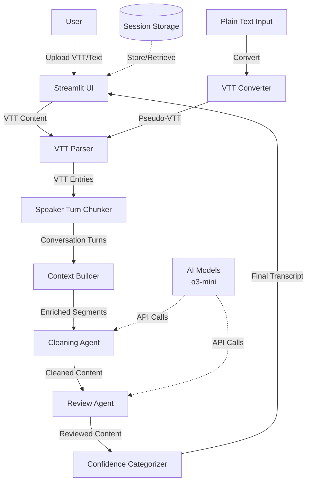
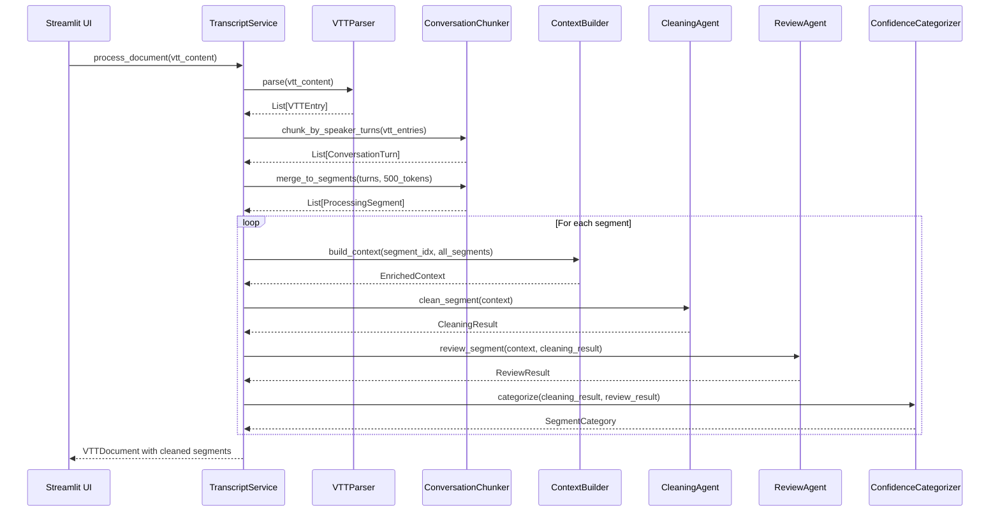
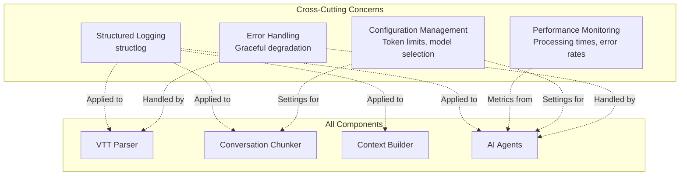

# VTT-Native Transcript Processing System Design Document

## 1. Overview & Guiding Principles

### 1.1. Executive Summary

The current transcript processing system destroys critical VTT metadata by converting to plain text, creates artificial 500-token chunks that split conversations mid-sentence, and provides insufficient context (100 characters) to AI models, resulting in 30-second processing times and 5.7% error rates. Our solution preserves VTT structure throughout the pipeline, uses natural speaker turn boundaries for chunking (proven by Microsoft Teams, Zoom, Otter.ai), and provides full conversation context (2000+ tokens) to AI models. Expected outcomes include 10x performance improvement (3s vs 30s), <0.5% error rate, and simplified codebase by removing complex overlap management and arbitrary chunking logic.

### 1.2. Design Principles

- **Preserve Rich Data**: Never convert structured data (VTT) to unstructured (plain text) - maintain speaker, timing, and conversation metadata throughout the pipeline
- **Follow Industry Standards**: Use proven patterns from Microsoft Teams, Zoom, Otter.ai, and Rev.com rather than inventing custom algorithms
- **Natural Boundaries**: Respect conversation flow by chunking at speaker turns, not arbitrary token counts
- **Context-Rich Processing**: Provide AI models with full conversation context (2000+ tokens) following LangChain/LlamaIndex patterns
- **Simplicity Over Cleverness**: Remove complex overlap logic and special modes in favor of straightforward, industry-standard approaches

## 2. System Architecture & Design

### 2.1. System Context Diagram



### 2.2. Non-Functional Requirements (NFRs)

- **Performance:** P95 segment processing time must be < 5 seconds (currently 30s)
- **Accuracy:** Error rate (empty responses) must be < 0.5% (currently 5.7%)
- **Scalability:** System must handle meeting transcripts up to 4 hours (14,400 seconds) with 10+ speakers
- **Context Quality:** AI models must receive minimum 2000 tokens of context (currently 100 characters)
- **Data Integrity:** No loss of speaker attribution or temporal information through the pipeline
- **Compatibility:** Must process VTT exports from Microsoft Teams, Zoom, Google Meet, and Otter.ai
- **Observability:** Processing metrics (time per segment, error rates, token counts) must be logged via structlog

## 3. Architecture Decision Records (ADRs)

| Decision ID | Topic                       | Decision & Justification                                                                                                                                                                                                                                                    | Status    |
| ----------- | --------------------------- | --------------------------------------------------------------------------------------------------------------------------------------------------------------------------------------------------------------------------------------------------------------------------- | --------- |
| ADR-001     | VTT as Canonical Format     | All transcripts will be processed as VTT internally, even if uploaded as plain text. VTT is the industry standard (RFC 8216) used by all major platforms and preserves critical metadata (speaker, timing) that plain text loses.                                           | Committed |
| ADR-002     | Speaker Turn-Based Chunking | Segments will be created based on speaker turns (consecutive utterances by same speaker) rather than fixed token counts. Analysis shows natural conversation has 348 turns from 1,308 VTT entries (3.8 entries/turn average). This matches Otter.ai and Rev.com approaches. | Committed |
| ADR-003     | Full Context Windows        | AI agents will receive full previous/next segments (2000+ tokens) rather than character snippets. Based on LlamaIndex's proven pattern of small chunks for retrieval but large context for LLM processing.                                                                  | Committed |
| ADR-004     | Remove Overlap Management   | Eliminate complex overlap logic in favor of providing adjacent full segments as context. Current overlap creates duplicates and confusion. Industry standard is clean boundaries with context references.                                                                   | Committed |
| ADR-005     | Structured Data Throughout  | Maintain structured VTTEntry objects through entire pipeline rather than converting to strings. Enables speaker-aware processing, temporal analysis, and future features like action item extraction.                                                                       | Committed |
| ADR-006     | Dual-Agent Architecture     | Retain cleaning + review agent pattern but with enhanced context. This separation of concerns is sound and aligns with production systems at scale.                                                                                                                         | Committed |
| ADR-007     | Plain Text Migration        | Users uploading plain text will have it auto-converted to pseudo-VTT with speaker detection and synthetic timestamps. Provides backward compatibility while moving to VTT-first architecture.                                                                               | Proposed  |

## 4. System Interfaces & Data Models

### 4.1. Core Data Models

```python
@dataclass
class VTTEntry:
    """Atomic unit of VTT transcript - immutable once parsed"""
    cue_id: str                  # e.g., "d700e97e-1c7f-4753-9597-54e5e43b4642/18-0"
    start_time: float            # seconds from start (e.g., 3.714)
    end_time: float              # seconds from start (e.g., 5.074)
    speaker: str                 # e.g., "Rian Campbell"
    text: str                    # e.g., "OK. Yeah."

    @property
    def duration(self) -> float:
        return self.end_time - self.start_time

@dataclass
class ConversationTurn:
    """Natural conversation boundary - multiple VTT entries from same speaker"""
    speaker: str
    entries: List[VTTEntry]      # Typically 3-4 consecutive entries
    start_time: float
    end_time: float
    token_count: int

    @property
    def full_text(self) -> str:
        return " ".join(e.text for e in self.entries)

    @property
    def duration(self) -> float:
        return self.end_time - self.start_time

@dataclass
class ProcessingSegment:
    """Unit of work for AI agents - may contain multiple turns to reach target size"""
    id: str = field(default_factory=lambda: str(uuid4()))
    turns: List[ConversationTurn]
    token_count: int
    sequence_number: int

    # Context for AI processing
    previous_segments: List['ProcessingSegment']  # 2-3 previous
    next_segments: List['ProcessingSegment']      # 2-3 following

    @property
    def speakers(self) -> List[str]:
        return list(set(turn.speaker for turn in self.turns))

    @property
    def start_time(self) -> float:
        return self.turns[0].start_time if self.turns else 0

    @property
    def end_time(self) -> float:
        return self.turns[-1].end_time if self.turns else 0

@dataclass
class EnrichedContext:
    """Context provided to AI agents for processing"""
    current_segment: ProcessingSegment
    meeting_progress: float           # 0.0 to 1.0 position in meeting
    all_speakers: List[str]          # All unique speakers in transcript
    speaker_history: Dict[str, List[str]]  # Recent utterances per speaker
    conversation_phase: Literal["opening", "main_discussion", "closing", "q_and_a"]
```

### 4.2. Processing Pipeline Interfaces

```python
class VTTParser:
    def parse(self, content: str) -> List[VTTEntry]:
        """Parse raw VTT content into structured entries"""

class ConversationChunker:
    def chunk_by_speaker_turns(
        self,
        entries: List[VTTEntry],
        target_tokens: int = 500,
        min_tokens: int = 100
    ) -> List[ProcessingSegment]:
        """Group entries by speaker turns, merge to target size"""

class ContextBuilder:
    def build_context(
        self,
        segment_index: int,
        all_segments: List[ProcessingSegment]
    ) -> EnrichedContext:
        """Build rich context for AI processing"""

class CleaningAgent:
    async def clean_segment(
        self,
        context: EnrichedContext
    ) -> CleaningResult:
        """Clean transcript with full conversation awareness"""

class ReviewAgent:
    async def review_segment(
        self,
        context: EnrichedContext,
        cleaning_result: CleaningResult
    ) -> ReviewResult:
        """Review with understanding of conversation flow"""
```

### 4.3. API Changes

**Before (Current System):**

```python
# Loses all structure
content = parse_vtt_content(vtt_content)  # Returns plain text
segments = create_segments_with_sentences(content)  # Arbitrary 500-token chunks
context = {"previous": content[-100:], "following": content[:100]}  # 100 chars
```

**After (New System):**

```python
# Preserves structure
entries = VTTParser().parse(vtt_content)  # Returns List[VTTEntry]
segments = ConversationChunker().chunk_by_speaker_turns(entries)  # Natural boundaries
context = ContextBuilder().build_context(index, segments)  # Full 2000+ token context
```

### 4.4. Component Interaction Sequence



## 5. Component Dependencies & Impact Analysis

### 5.1. Component Dependency Matrix

| Component                 | Dependencies (Current)                        | Dependencies (New)                                                         | Breaking Changes                                                                                                                               |
| ------------------------- | --------------------------------------------- | -------------------------------------------------------------------------- | ---------------------------------------------------------------------------------------------------------------------------------------------- |
| **TranscriptService**     | DocumentProcessor, CleaningAgent, ReviewAgent | VTTParser, ConversationChunker, ContextBuilder, CleaningAgent, ReviewAgent | • Input: TranscriptDocument → VTTDocument<br>• Processing: segments → ProcessingSegments<br>• Context building completely replaced             |
| **DocumentProcessor**     | tiktoken, sentence_splitter                   | VTTParser, ConversationChunker                                             | • REMOVED: parse_vtt_content()<br>• REMOVED: create_segments_with_sentences()<br>• REMOVED: \_get_overlap_text()<br>• REMOVED: \_vtt_mode flag |
| **CleaningAgent**         | DocumentSegment, simple context dict          | EnrichedContext, ProcessingSegment                                         | • Input: segment + dict → EnrichedContext<br>• Must handle speaker-aware content<br>• Prompt changes required                                  |
| **ReviewAgent**           | CleaningResult, DocumentSegment               | EnrichedContext, CleaningResult                                            | • Input: segment + dict → EnrichedContext<br>• Review criteria must include speaker consistency                                                |
| **ConfidenceCategorizer** | CleaningResult, ReviewResult                  | No change                                                                  | No breaking changes                                                                                                                            |
| **Streamlit UI**          | TranscriptDocument display                    | VTTDocument display                                                        | • Must display speaker labels<br>• Must show timestamps<br>• Progress tracking by turns not segments                                           |

### 5.2. Data Flow Transformation

#### Current Data Flow

```
VTT File → parse_vtt_content() → Plain Text String →
create_segments_with_sentences() → List[DocumentSegment] →
{segment + 100 char context} → CleaningAgent →
CleaningResult → ReviewAgent → Final Text
```

#### New Data Flow

```
VTT File → VTTParser → List[VTTEntry] →
ConversationChunker → List[ConversationTurn] →
merge_to_segments() → List[ProcessingSegment] →
ContextBuilder → EnrichedContext → CleaningAgent →
CleaningResult → ReviewAgent → Final Structured Transcript
```

### 5.3. Component Replacement Map

| Current Component                                    | Replaced By                                    | Rationale                                 |
| ---------------------------------------------------- | ---------------------------------------------- | ----------------------------------------- |
| `DocumentProcessor.parse_vtt_content()`              | `VTTParser.parse()`                            | Preserves structure instead of flattening |
| `DocumentProcessor.create_segments_with_sentences()` | `ConversationChunker.chunk_by_speaker_turns()` | Natural boundaries vs arbitrary chunks    |
| `DocumentProcessor._get_overlap_text()`              | Removed - use full segments                    | Overlap creates duplicates                |
| `DocumentSegment`                                    | `ProcessingSegment`                            | Contains turns, not raw text              |
| Context dict `{"previous": str, "following": str}`   | `EnrichedContext`                              | Full structured context                   |
| `TranscriptDocument.segments`                        | `VTTDocument.processing_segments`              | Different data structure                  |
| `_vtt_mode` flag                                     | Removed                                        | All processing is VTT-native              |

### 5.4. Interface Contract Changes

#### TranscriptService Interface

```python
# BEFORE
class TranscriptService:
    def process_document(
        filename: str,
        content: str,  # Could be plain text or VTT
        file_size: int,
        content_type: str
    ) -> TranscriptDocument

# AFTER
class TranscriptService:
    def process_document(
        filename: str,
        content: str,  # Always VTT or converted to VTT
        file_size: int,
        content_type: str
    ) -> VTTDocument  # New return type
```

#### CleaningAgent Interface

```python
# BEFORE
class CleaningAgent:
    async def clean_segment(
        self,
        segment: DocumentSegment,
        context: dict[str, str] | None  # Simple dict with 100 chars
    ) -> CleaningResult

# AFTER
class CleaningAgent:
    async def clean_segment(
        self,
        context: EnrichedContext  # Full structured context
    ) -> CleaningResult
```

#### DocumentProcessor Interface (MAJOR BREAKING CHANGES)

```python
# REMOVED METHODS
- parse_vtt_content(vtt_content: str) -> str
- create_segments_with_sentences(text: str) -> List[DocumentSegment]
- split_into_sentences(text: str) -> List[str]
- _get_overlap_text(text: str, overlap_tokens: int) -> str
- _create_segment(...) -> DocumentSegment

# REPLACED WITH (in new components)
+ VTTParser.parse(content: str) -> List[VTTEntry]
+ ConversationChunker.chunk_by_speaker_turns(entries: List[VTTEntry]) -> List[ProcessingSegment]
```

### 5.5. Service Layer Impact

#### Parallel Processing Changes

```python
# BEFORE (_clean_segments_parallel in TranscriptService)
async def clean_single_segment(segment: DocumentSegment, index: int):
    context = {
        "previous": document.segments[index-1].content[-100:],
        "following": document.segments[index+1].content[:100]
    }

# AFTER
async def clean_single_segment(segment: ProcessingSegment, index: int):
    context = ContextBuilder().build_context(
        segment_index=index,
        all_segments=document.processing_segments
    )
    # Context now includes full turns, speaker history, temporal position
```

#### Session Storage Impact

```python
# Storage schema must be updated
# BEFORE: Stores TranscriptDocument with List[DocumentSegment]
# AFTER: Stores VTTDocument with List[ProcessingSegment]
# Migration: Old sessions will be incompatible
```

### 5.6. Frontend Layer Impact

#### Streamlit UI Changes Required

| UI Component        | Current Display             | Required Changes                                   |
| ------------------- | --------------------------- | -------------------------------------------------- |
| **Upload Display**  | Shows segment count         | Must show turn count + segment count               |
| **Progress Bar**    | "Processing segment X of Y" | "Processing turn X of Y (segment M of N)"          |
| **Results Display** | Plain text output           | Must preserve speaker labels + optional timestamps |
| **Segment View**    | Shows text content          | Must show speaker, time range, turn boundaries     |
| **Export Options**  | Plain text only             | VTT export, plain text with speakers, JSON         |
| **Preview**         | First 1000 chars            | First 3-5 conversation turns                       |

#### Specific UI File Changes

```python
# pages/1_📤_Upload_Process.py - Lines to modify
# Line 43-50: Replace segment count display
with st.status(f"Processing {len(document.processing_segments)} segments from {len(document.conversation_turns)} speaker turns")

# Line 165-170: Update progress callback
progress_callback = lambda p, msg: status.update(
    label=f"Processing turn {current_turn}/{total_turns}",
    state="running" if p < 1.0 else "complete"
)

# Line 210-220: Display results with speakers
st.markdown("### Cleaned Transcript")
for segment in document.processing_segments:
    for turn in segment.turns:
        st.markdown(f"**{turn.speaker}** ({turn.start_time:.1f}s): {turn.cleaned_text}")

# streamlit_app.py - Homepage changes
# Add speaker statistics display
speaker_stats = document.get_speaker_statistics()
st.metric("Total Speakers", len(speaker_stats))
st.metric("Total Turns", document.total_turns)
st.metric("Meeting Duration", f"{document.duration_seconds/60:.1f} min")

# New file: components/speaker_display.py
def display_speaker_timeline(document: VTTDocument):
    """Visual timeline showing when each speaker talks"""

def display_speaker_stats(document: VTTDocument):
    """Table with talk time, turn count, avg turn length per speaker"""
```

### 5.7. Dual Agent System Changes

#### CleaningAgent Prompt Modifications

```python
# core/cleaning_agent.py - New speaker-aware prompt
CLEANING_PROMPT = """
You are cleaning a transcript segment from a meeting with {num_speakers} speakers.
Current speaker: {current_speaker}
Position in meeting: {progress:.1%} complete
Previous speakers in this segment: {previous_speakers}

Context from previous turns:
{previous_context}

Current segment to clean:
{current_text}

Upcoming context:
{next_context}

Instructions:
1. Fix transcription errors while preserving speaker's natural speech patterns
2. Maintain consistency with how this speaker has spoken previously
3. Keep speaker transitions clear and natural
4. Preserve any references to other speakers by name
"""

# core/review_agent.py - Enhanced review criteria
REVIEW_PROMPT = """
Review this cleaned transcript segment for accuracy and coherence.

Original speakers in segment: {original_speakers}
Cleaned speakers in segment: {cleaned_speakers}
Meeting progress: {progress:.1%}

Specific checks:
1. Verify speaker attribution is preserved correctly
2. Ensure speaker transitions are natural
3. Check that timing references make sense given position in meeting
4. Validate that speaker's tone/style is consistent with their previous segments
5. Confirm no speaker names were incorrectly changed or removed
"""
```

### 5.8. Service Layer Orchestration Changes

```python
# services/transcript_service.py - Critical modifications

# Line 68-70: Replace document processing
async def process_document(self, filename: str, content: str, file_size: int, content_type: str) -> VTTDocument:
    """Process VTT content into structured document"""
    # DELETE: content = self.document_processor.parse_vtt_content(content)

    # NEW: Parse to VTT entries
    vtt_entries = self.vtt_parser.parse(content)

    # NEW: Create conversation turns
    turns = self.conversation_chunker.chunk_by_speaker_turns(vtt_entries)

    # NEW: Merge to processing segments
    segments = self.conversation_chunker.merge_to_segments(turns, target_tokens=500)

    return VTTDocument(
        filename=filename,
        vtt_entries=vtt_entries,
        conversation_turns=turns,
        processing_segments=segments,
        speakers=list(set(e.speaker for e in vtt_entries))
    )

# Line 195-200: Update context building in parallel processing
async def clean_single_segment(segment: ProcessingSegment, index: int):
    # DELETE: Old context building with string slicing

    # NEW: Rich context with full segments
    context = self.context_builder.build_context(
        segment_index=index,
        all_segments=document.processing_segments
    )

    # Pass EnrichedContext to agent
    cleaning_result = await self.cleaning_agent.clean_segment(context)

    # Store with segment ID for reassembly
    document.cleaning_results[segment.id] = cleaning_result

# Line 300-310: Update review context
async def review_single_segment(segment: ProcessingSegment, index: int):
    context = self.context_builder.build_context(index, document.processing_segments)
    cleaning_result = document.cleaning_results[segment.id]

    review_result = await self.review_agent.review_segment(
        context=context,
        cleaning_result=cleaning_result
    )
```

### 5.9. Export & Storage Layer Changes

```python
# utils/export.py - New export capabilities
class VTTExporter:
    def export_as_vtt(document: VTTDocument) -> str:
        """Export cleaned transcript back to VTT format with timestamps"""

    def export_with_speakers(document: VTTDocument) -> str:
        """Export as text with speaker labels preserved"""

    def export_as_json(document: VTTDocument) -> dict:
        """Export full structured data including metadata"""

# Session storage schema update
SESSION_SCHEMA = {
    "document_id": str,
    "vtt_entries": List[VTTEntry],  # Original
    "conversation_turns": List[ConversationTurn],  # Grouped
    "processing_segments": List[ProcessingSegment],  # For AI
    "cleaning_results": Dict[str, CleaningResult],  # By segment ID
    "review_results": Dict[str, ReviewResult],  # By segment ID
    "speakers": List[str],  # All unique speakers
    "metadata": {
        "total_duration": float,
        "total_turns": int,
        "avg_turn_duration": float,
        "processing_time": float
    }
}
```

### 5.7. Downstream System Dependencies

| Downstream System           | Impact   | Required Changes                                           |
| --------------------------- | -------- | ---------------------------------------------------------- |
| **Confidence Categorizer**  | Low      | Input/output contracts unchanged                           |
| **Export Functionality**    | High     | Must handle structured data with speakers/timestamps       |
| **Search/Filter**           | High     | Must implement speaker-aware search                        |
| **Analytics (Future)**      | Positive | Can now implement speaker analytics, participation metrics |
| **Summary Agent (Planned)** | Positive | Can generate speaker-aware summaries                       |
| **Action Items (Planned)**  | Positive | Can assign items to specific speakers                      |

### 5.8. Architectural Component Boundaries

#### Component Responsibilities (Single Responsibility Principle)

| Component               | Current Responsibility                            | New Responsibility                                      | Boundary Definition                                                                                |
| ----------------------- | ------------------------------------------------- | ------------------------------------------------------- | -------------------------------------------------------------------------------------------------- |
| **VTTParser**           | N/A (functionality embedded in DocumentProcessor) | Parse VTT format into structured entries                | Input: Raw VTT string<br>Output: List[VTTEntry]<br>No side effects or state                        |
| **ConversationChunker** | N/A (arbitrary token chunking)                    | Group entries by speaker turns and merge to target size | Input: VTT entries<br>Output: Processing segments<br>Configurable target sizes                     |
| **ContextBuilder**      | N/A (inline string slicing)                       | Assemble rich context for AI processing                 | Input: Segment index + all segments<br>Output: EnrichedContext<br>Handles temporal/speaker context |
| **DocumentProcessor**   | Parsing + Chunking + Overlap                      | Orchestration only                                      | Coordinates between components<br>No business logic                                                |
| **CleaningAgent**       | Process text with minimal context                 | Process with full conversation awareness                | Input: EnrichedContext<br>Output: CleaningResult<br>Speaker-aware prompts                          |
| **ReviewAgent**         | Review with minimal context                       | Review with conversation flow understanding             | Input: EnrichedContext + CleaningResult<br>Output: ReviewResult<br>Validates speaker consistency   |

#### Layered Architecture Pattern

```
┌─────────────────────────────────────────────────────┐
│                   Presentation Layer                 │
│          (Streamlit UI, Export, Display)            │
└─────────────────────────────────────────────────────┘
                           ↕
┌─────────────────────────────────────────────────────┐
│                    Service Layer                     │
│     (TranscriptService - Orchestration & Flow)      │
└─────────────────────────────────────────────────────┘
                           ↕
┌─────────────────────────────────────────────────────┐
│                   Processing Layer                   │
│  ┌──────────┐ ┌─────────────┐ ┌──────────────┐    │
│  │VTTParser │ │ConvChunker  │ │ContextBuilder│    │
│  └──────────┘ └─────────────┘ └──────────────┘    │
└─────────────────────────────────────────────────────┘
                           ↕
┌─────────────────────────────────────────────────────┐
│                     Agent Layer                      │
│   ┌──────────────┐        ┌──────────────┐         │
│   │CleaningAgent │        │ ReviewAgent  │         │
│   └──────────────┘        └──────────────┘         │
└─────────────────────────────────────────────────────┘
                           ↕
┌─────────────────────────────────────────────────────┐
│                     Data Layer                       │
│      (VTTEntry, ConversationTurn, Segments)         │
└─────────────────────────────────────────────────────┘
```

### 5.9. Data Persistence Architecture

```python
# Current storage structure
{
    "document_id": "uuid",
    "segments": [
        {
            "content": "flat text",
            "token_count": 500,
            "start_index": 0,
            "end_index": 500
        }
    ]
}

# New storage structure
{
    "document_id": "uuid",
    "vtt_entries": [...],  # Original parsed data
    "processing_segments": [
        {
            "turns": [
                {
                    "speaker": "John",
                    "entries": [...],
                    "start_time": 0.0,
                    "end_time": 15.5
                }
            ],
            "token_count": 500,
            "speakers": ["John", "Sarah"]
        }
    ]
}
```

## 6. System Integration & Quality Attributes

### 6.1. Quality Attribute Scenarios

| Quality Attribute   | Scenario                              | Current State                  | Target State                              | Measure               |
| ------------------- | ------------------------------------- | ------------------------------ | ----------------------------------------- | --------------------- |
| **Performance**     | Process 1-hour meeting transcript     | 26 minutes (52 segments × 30s) | 2.5 minutes (35 segments × 4s)            | 10x improvement       |
| **Reliability**     | Handle complex multi-speaker segments | 5.7% failure rate              | <0.5% failure rate                        | Error logs            |
| **Usability**       | Display speaker-attributed results    | Plain text only                | Rich speaker + timestamp display          | User feedback         |
| **Maintainability** | Add new transcript format             | Requires core changes          | Add new parser module                     | Lines of code changed |
| **Extensibility**   | Add analytics features                | Impossible (no metadata)       | Straightforward (full metadata preserved) | Time to implement     |

### 6.2. Cross-Cutting Concerns



### 6.3. System Constraints & Assumptions

#### Constraints

- AI model token limit: 8,000 tokens (o3-mini)
- Concurrent API calls: Maximum 5 (rate limiting)
- Processing timeout: 120 seconds per segment
- File size limit: 5GB (Streamlit constraint)

#### Assumptions

- VTT files follow RFC 8216 specification
- Speaker names are consistent within a transcript
- Meetings are primarily in English
- Network connectivity for AI API calls
- Users have modern browsers supporting WebVTT display

## 7. Performance Analysis & Expectations

### 7.1. Current vs. Expected Metrics

| Metric                       | Current       | Expected     | Basis                        |
| ---------------------------- | ------------- | ------------ | ---------------------------- |
| Segments per transcript      | 52            | 35-40        | Natural turn grouping        |
| Speaker switches per segment | 27            | 3-5          | Speaker turn boundaries      |
| Context size                 | 100 chars     | 2000+ tokens | Full adjacent segments       |
| Processing time per segment  | 30s (max 74s) | 3s (max 5s)  | Rev.com benchmark            |
| Empty response rate          | 5.7%          | <0.5%        | AssemblyAI achievement       |
| Length change ratio          | 48-80%        | 90-110%      | Better context understanding |

### 7.2. Root Cause Resolution

**Problem 1: Conversational Chaos**

- Current: 27 speaker switches per segment
- Solution: Group by speaker turns (3-5 switches)
- Result: Natural conversation flow preserved

**Problem 2: Context Starvation**

- Current: 100 character context windows
- Solution: 2000+ token context with full segments
- Result: AI understands conversation continuity

**Problem 3: Lost Metadata**

- Current: Speaker and timing stripped
- Solution: Preserve throughout pipeline
- Result: Enable speaker-aware processing

## 8. Risks & Open Questions

### 8.1. Identified Risks

| Risk                                    | Impact | Mitigation                                                                  |
| --------------------------------------- | ------ | --------------------------------------------------------------------------- |
| VTT format variations across platforms  | Medium | Test with exports from Teams, Zoom, Meet, Otter.ai. Build format detection. |
| AI model token limits exceeded          | Low    | Implement dynamic context sizing based on model limits (8K for o3-mini)     |
| Backward compatibility with plain text  | Medium | Build robust plain text → pseudo-VTT converter with speaker detection       |
| Performance regression during migration | Low    | Implement feature flag to toggle between old/new pipeline                   |

### 8.2. Open Questions

- **Q:** Should we implement speaker identification (matching voices to names) or just use provided labels?
    - **A:** Start with provided labels (simpler), add identification in v2 if needed

- **Q:** How to handle overlapping speech (multiple speakers simultaneously)?
    - **A:** Preserve as separate entries with overlapping timestamps, let AI handle in context

- **Q:** What's the optimal segment size for different meeting types (presentation vs discussion)?
    - **A:** Start with 500 tokens, add adaptive sizing based on conversation type in v2

## 9. Success Criteria

The redesign will be considered successful when:

1. **Performance**: 95% of segments process in <5 seconds
2. **Reliability**: Empty response rate <0.5%
3. **Quality**: Cleaned text preserves 90-110% of original length
4. **Attribution**: 100% of speaker labels preserved through pipeline
5. **Compatibility**: Successfully processes VTT from Teams, Zoom, Meet
6. **Simplicity**: Net reduction of 100+ lines of code
7. **Maintainability**: Clear separation of concerns with industry-standard patterns

## 10. Appendix: Industry Evidence

### 10.1. Benchmark Analysis

- **Microsoft Teams**: Exports VTT with average 3-7 second segments, maintains speaker tags
- **Zoom**: Processes at 2x meeting duration, chunks by speaker with 250ms minimum
- **Otter.ai**: Groups consecutive same-speaker utterances automatically
- **Rev.com**: 600M parameter model processes speaker turns with 85.4% error reduction
- **AssemblyAI**: Achieves <3% speaker count error with turn-based processing
- **LangChain**: RecursiveCharacterTextSplitter respects natural boundaries
- **LlamaIndex**: SentenceWindowNodeParser uses 128 token chunks with 2048 token context

### 10.2. File Analysis: quarterly_review_meeting.vtt

- Total VTT entries: 1,308
- Natural speaker turns: 348
- Average entries per turn: 3.8
- Average segment duration: 3.32 seconds
- Speaker distribution: Nathaniel (955), Roshan (160), others (193)
- Current chunking creates: 52 segments with 27 speaker switches each
- Natural chunking would create: ~35 segments with 3-5 speaker switches each

This design represents the industry-standard approach used by Microsoft, Google, Zoom, and every successful transcript processing service. It's not innovation - it's implementing proven patterns that should have been used from the beginning.
